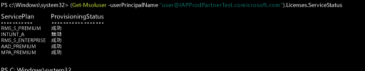

# Intune のライセンスを管理する
Intune サービスにサインインして使用したり、デバイスを管理対象に登録したりするためには、先に [Office 365 ポータル](http://go.microsoft.com/fwlink/p/?LinkId=698854)を使用して、各ユーザーに Intune サブスクリプションのライセンスを割り当てる必要があります。 ライセンスを割り当てられたユーザーの名前は、Intune 管理コンソールに表示されます。 ユーザーは最大 5 つのデバイスを登録できます。

Microsoft の Enterprise Mobility Suite (EMS) を使用している組織には、EMS パッケージの Azure Active Directory Premium または Intune サービスのみが必要なユーザーがいる場合があります。 [Azure Active Directory PowerShell コマンドレット](https://msdn.microsoft.com/library/jj151815.aspx)を使用して、いずれかのサービスまたはサービスのサブセットを割り当てることができます。 詳細については、「[PowerShell を使用して Intune ライセンスを管理する](start-with-a-paid-subscription-to-microsoft-intune-step-4-posh.md)」をご覧ください。

## Intune のライセンスを割り当てる方法
オンプレミスの Active Directory から同期しているユーザー アカウントや、[Office 365 ポータル](http://go.microsoft.com/fwlink/p/?LinkId=698854)を使用してクラウド サービスのサブスクリプションに手動で追加されたユーザー アカウントには、Intune のライセンスが自動的に割り当てられません。 代わりに、後で Intune テナント管理者が Office 365 ポータルでユーザー アカウントを編集して、ユーザーにライセンスを割り当てる必要があります。

サブスクリプションに関連付けられている他のクラウド サービスと Azure AD を共有している場合、これらのサービスに追加されたユーザーにもアクセスできます。 この各ユーザーには、管理者がライセンスを割り当てるまで、[!INCLUDE[wit_nextref](../includes/wit_nextref_md.md)] のライセンスは付与されません。

> [!TIP]
> [!INCLUDE[wit_nextref](../includes/wit_nextref_md.md)] へのライセンスの割り当てまたはライセンスの失効を行うオプションが無効になっている場合、[Enterprise Mobility Suite](https://www.microsoft.com/en-us/server-cloud/enterprise-mobility/overview.aspx) を使用する場合に利用できるボリューム ライセンス オプションなどが、サブスクリプションに含まれている可能性があります。 ライセンスを割り当てる、または失効させる方法の詳細については、ライセンス オプションのドキュメントを参照してください。

## Intune のユーザー ライセンスを割り当てる

[Office 365 ポータル](http://go.microsoft.com/fwlink/p/?LinkId=698854)を使用して、手動でクラウドベースのユーザーを追加し、クラウドベースのユーザー アカウントと、オンプレミスの Active Directory から Azure AD に同期されているアカウントの両方にライセンスを割り当てます。

1.  テナント管理者の資格情報を使用して [Office 365 ポータル](http://go.microsoft.com/fwlink/p/?LinkId=698854)にサインインした後、**[ユーザー]** > **[すべてのユーザー]** の順に選択します。

2.  Intune のユーザー ライセンスを割り当てるユーザー アカウントを選択し、「**Microsoft Intune**」(スタンドアロン) か「**Enterprise Mobility Suite**」のいずれかを選択します。

3.  ユーザー アカウントが、サービスを使用してデバイスを管理に登録するために必要なアクセス許可を持つようになります。

### PowerShell を使用して、EMS ユーザー ライセンスを選択的に管理する
Microsoft の Enterprise Mobility Suite (EMS) を使用している組織には、EMS パッケージの Azure Active Directory Premium または Intune サービスのみが必要なユーザーがいる場合があります。 [Azure Active Directory PowerShell コマンドレット](https://msdn.microsoft.com/library/jj151815.aspx)を使用して、いずれかのサービスまたはサービスのサブセットを割り当てることができます。

EMS サービスのユーザー ライセンスを選択的に割り当てるには、[Azure Active Directory Module for Windows PowerShell](https://msdn.microsoft.com/library/jj151815.aspx#bkmk_installmodule) がインストールされているコンピューターで管理者として PowerShell を開きます。 PowerShell は、ローカル コンピューターまたは ADFS サーバーにインストールできます。

目的のサービス プランにのみ適用される新しいライセンス SKU 定義を作成する必要があります。 これを行うには、適用しないプランを無効にします。 たとえば、Intune ライセンスを割り当てないライセンス SKU 定義を作成できます。 利用できるサービスの一覧を確認するには、次のコマンドを入力します。

    (Get-MsolAccountSku | Where {$_.SkuPartNumber -eq "EMS"}).ServiceStatus

次のコマンドを実行すると、Intune サービス プランを除外できます。 同じメソッドを使用して、セキュリティ グループ全体に展開することや、より詳細なフィルターを使用することができます。

**例 1** コマンド ラインで、新しいユーザーを作成し、ライセンスに含まれる Intune を有効にせずに EMS ライセンスを割り当てます。

    Connect-MsolService

    New-MsolUser -DisplayName “Test User” -FirstName FName -LastName LName -UserPrincipalName user@<TenantName>.onmicrosoft.com –Department DName -UsageLocation US

    $CustomEMS = New-MsolLicenseOptions -AccountSkuId "<TenantName>:EMS" -DisabledPlans INTUNE_A
    Set-MsolUserLicense -UserPrincipalName user@<TenantName>.onmicrosoft.com -AddLicenses <TenantName>:EMS -LicenseOptions $CustomEMS

次のコマンドで確認します。

    (Get-MsolUser -UserPrincipalName "user@<TenantName>.onmicrosoft.com").Licenses.ServiceStatus

**例 2** ライセンスが既に割り当てられているユーザーに対して、EMS ライセンスに含まれる Intune を無効にします。

    Connect-MsolService

    Set-MsolUserLicense -UserPrincipalName user@<TenantName>.onmicrosoft.com -RemoveLicenses IAPProdPartnerTest:EMS

    $CustomEMS = New-MsolLicenseOptions -AccountSkuId "<TenantName>:EMS" -DisabledPlans INTUNE_A
    Set-MsolUserLicense -UserPrincipalName user@<TenantName>.onmicrosoft.com -AddLicenses <TenantName>:EMS -LicenseOptions $CustomEMS

次のコマンドで確認します。

    (Get-MsolUser -UserPrincipalName "user@<TenantName>.onmicrosoft.com" .Licenses.ServiceStatus

### 次のステップ
これで終了です。 *Intune のクイック スタート ガイド*の手順 4 が完了しました。
>[!div class="step-by-step"]

>[&larr; **Intune にユーザーを同期する**](.\start-with-a-paid-subscription-to-microsoft-intune-step-2.md)     [**ユーザーとデバイスを整理する**&rarr;](.\start-with-a-paid-subscription-to-microsoft-intune-step-5.md)  

<!--HONumber=Aug16_HO1-->

