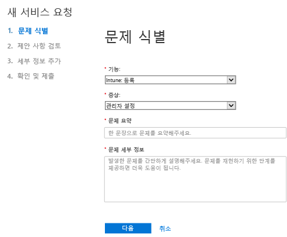
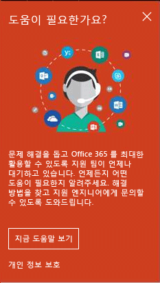
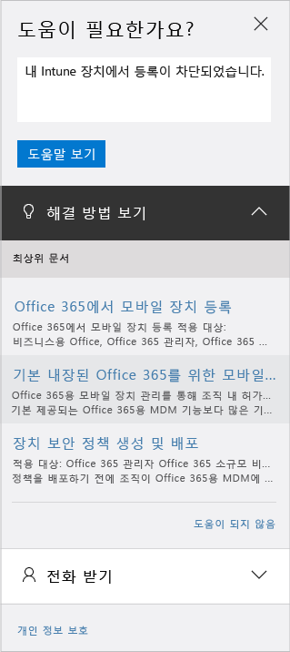

# Microsoft Intune에 대한 관리 지원을 받는 방법

[!INCLUDE[classic-portal](../includes/classic-portal.md)]

Microsoft는 Microsoft Intune에 대한 세계적인 기술 지원, 판매 전 지원, 대금 청구 및 구독 지원을 제공합니다. 유료 및 평가판 구독 둘 다에 대해 온라인과 전화 지원이 제공됩니다. 온라인 기술 지원은 영어와 일본어로 제공됩니다. 전화 지원과 온라인 대금 청구 지원은 추가 언어로 제공됩니다.

Intune을 Configuration Manager와 함께 사용할 경우 intune에 대한 지원은 무료로 제공됩니다. 프리미어 지원 고객은 절차 질문(예: Intune 기능을 구성하는 방법)에 대해 요금이 부과됩니다.

## 온라인 서비스 티켓 만들기

1.  Intune 자격 증명을 사용하여 [Office 365 관리 센터](https://portal.office.com)에 로그인합니다.
    >[!NOTE]
    >
    >프리미어 지원 고객은 [프리미어 지원 페이지](https://support.microsoft.com/en-us/premier/contacts)에서 Intune 지원 티켓을 열 수 있습니다.

2.  **관리** 타일을 선택합니다.
3.  왼쪽의 **지원** 아래에서 **지원**을 선택하여 티켓을 엽니다.

    

    >[!NOTE]
    >  100개 이하의 라이선스가 있는 O365 계정을 가지고 있거나 가지고 있었던 고객에게 이 메시지가 표시됩니다. 이 메시지가 표시된 경우 [대체 방법을 사용하여 지원 티켓 만들기](#create-a-support-ticket-with-alternate-methods)를 참조하세요.

    > 

    -   대금 청구, 라이선스 및 계정 문제에 대해서는 **대금 청구 및 제품 정보**를 선택합니다.

    -   기타 모든 Intune 문제에 대해서는 **모바일 장치 관리**를 선택합니다.

    > [!NOTE]
    > 목록의 맨 아래에 있는 **자세히**를 선택하여 모든 범주를 표시해야 할 수도 있습니다.

3.  지침에 따라 요청을 엽니다.

### 대체 방법을 사용하여 지원 티켓 만들기

지원 페이지가 다음과 같이 표시되는 경우 이 절차를 따르세요.

1. **도움이 필요하세요?**를 선택합니다.
2. 텍스트 상자에 문제에 대한 설명을 입력하고 **도움말 보기**를 선택합니다.

    

3. 제안된 온라인 리소스를 검토하거나 **Microsoft의 전화 받기**를 선택하여 Microsoft 지원의 전화를 받습니다.

## 전화 지원 받기
국가/지역별 지원 전화 번호, 지원 시간 및 각 지역의 지원 언어 목록은 [Microsoft Intune의 담당자 전화 지원](contact-assisted-phone-support-for-microsoft-intune.md)을 참조하세요.

## 서비스 요청 추적
1.  Intune 자격 증명을 사용하여 [Office 365 관리 센터](https://portal.office.com)에 로그인합니다.
2.  **관리** 타일을 선택합니다.
3.  왼쪽의 **지원** 아래에서 **서비스 요청**을 선택합니다. 그런 다음 요청을 검토할 수 있습니다.

서비스 요청에 대한 첫 번째 응답은 문제의 심각도에 따라 다릅니다. 가장 심각한 문제의 경우 전문가 고객에 대한 첫 번째 응답 시간은 2시간 이내입니다. 프리미어 지원 고객의 경우 지원 계약에 따라 응답이 달라집니다. 사례는 다음과 같습니다.

- 하나 이상의 서비스에 액세스할 수 없거나 사용할 수 없습니다.
- 프로덕션, 운영 또는 배포 마감일이 심각하게 영향을 받거나 프로덕션 또는 수익성에 심각한 영향을 미치게 됩니다.
- 여러 사용자 또는 서비스가 영향을 받습니다.

약간 심각한 문제의 경우 전문가 고객에 대한 첫 번째 응답 시간은 4시간 이내입니다. 프리미어 지원 고객의 경우 지원 계약에 따라 응답이 달라집니다.  사례는 다음과 같습니다.

- 서비스를 사용할 수 있지만 작동하지 않으며 정상 상태가 아닙니다.
- 이 상황은 업무에 어느 정도 영향을 주며 업무 시간 중 처리할 수 있습니다.
- 단일 사용자, 고객 또는 서비스가 부분적으로 영향을 받습니다.

기타 문제의 경우 전문가 고객에 대한 첫 번째 응답 시간은 8시간 이내입니다. 프리미어 지원 고객의 경우 지원 계약에 따라 응답이 달라집니다.  사례는 다음과 같습니다.

- 이 상황은 업무에 최소한의 영향을 줍니다.
- 이 상황은 중요하지만 고객의 현재 서비스 또는 생산성에 그다지 직접적인 영향을 미치지 않습니다.
- 단일 사용자가 부분적인 업무 중단을 겪지만 적절한 해결 방법이 있습니다.

> [!NOTE]
> **Microsoft System Center Configuration Manager** 또는 **Microsoft System Center Endpoint Protection을 사용하는 경우:** Configuration Manager 또는 Endpoint Protection 관련 기술 지원이 필요하면 파트너에 문의하거나 [Microsoft System Center Configuration Manager 및 System Center Endpoint Protection 솔루션 센터](http://www.microsoft.com/en-us/server-cloud/products/system-center-2012-r2/resources.aspx)를 방문하여 다양한 자가 진단 자료를 확인할 수 있습니다. 또한 온라인 또는 전화를 통해 지원 요청을 여는 옵션이 제공됩니다.
>
> System Center Configuration Manager 또는 System Center Endpoint Protection에 대한 기술 지원은 유료로 제공되며, 기존 라이선스 또는 프리미어 지원 계약이 있는 경우에는 지원 요금이 차감됩니다.

## 지원 티켓을 열지 않고 문제 해결

지원 티켓을 열지 않고 문제를 해결할 수도 있습니다.

Intune 관련 문제를 자체적으로 해결하려는 경우 [Microsoft Intune에 대한 일반적인 문제 해결 팁](general-troubleshooting-tips-for-microsoft-intune.md) 또는 특정 문제에 대한 문제 해결 항목을 참조하세요. 또한 [Intune 포럼](https://social.technet.microsoft.com/Forums/en-US/home?forum=microsoftintuneprod)에서 해결 방법을 검색하거나 질문을 게시할 수도 있습니다.

## 볼륨 라이선싱에 대한 지원 찾기
볼륨 라이선스 프로그램에 따라 Microsoft에서 라이선스를 이미 구매한 경우 지원을 위해 다음 리소스를 사용하세요.

-   라이선스 및 키 찾기 관련 지원은 [볼륨 라이선스 서비스 센터](http://go.microsoft.com/fwlink/p/?LinkID=282016)를 참조하세요.

-   대금 청구 관련 문의 사항은 [대금 청구 및 구독 관리 지원](http://support.microsoft.com/oas/default.aspx?prid=15371)을 참조하세요.

-   볼륨 라이선스에 대한 일반 정보는 [볼륨 라이선스](http://go.microsoft.com/fwlink/p/?LinkID=282015)를 참조하세요.

<!--HONumber=Dec16_HO2-->

