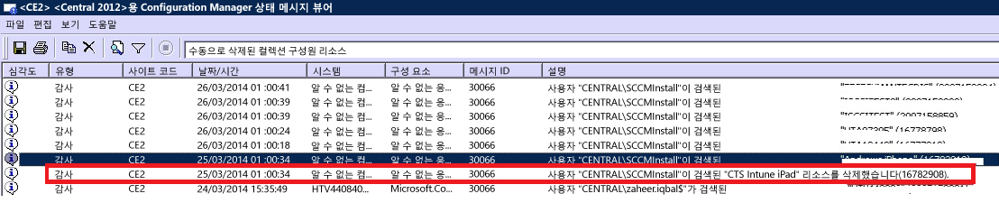

# Intune のデバイス登録に関するトラブルシューティング

このトピックでは、デバイス登録で問題が発生した場合の解決方法を提案します。 この情報で問題が解決しない場合、さらに役立つ方法を探すには、「[Microsoft Intune のサポートを受ける方法](how-to-get-support-for-microsoft-intune.md)」を参照してください。

## 最初のトラブルシューティングの手順

トラブルシューティングを開始する前に、登録を有効にするように Intune を構成していることを確認してください。 構成要件は次で確認できます。

-   [Microsoft Intune にデバイスを登録する準備](/intune/deploy-use/get-ready-to-enroll-devices-in-microsoft-intune)
-   [iOS および Mac のデバイス管理をセットアップする](/intune/deploy-use/set-up-ios-and-mac-management-with-microsoft-intune)
-   [Microsoft Intune を使用して Windows Phone と Windows 10 Mobile の管理をセットアップする](/intune/deploy-use/set-up-windows-phone-management-with-microsoft-intune)
-   [Windows デバイスの管理をセットアップする](/intune/deploy-use/set-up-windows-device-management-with-microsoft-intune)

管理対象デバイスのユーザーが登録ログと診断ログを収集しておくと、管理者が確認できます。 ユーザーがログを収集する手順については、次のページを参照してください。

- [USB ケーブルを使用して Android の診断データのログを IT 管理者に送信する](/intune/enduser/send-diagnostic-data-logs-to-your-it-administrator-using-a-usb-cable-android)
- [メールを使用して Android の診断データのログを IT 管理者に送信する](/intune/enduser/send-diagnostic-data-logs-to-your-it-administrator-using-email-android)
- [IT 管理者に Android の登録に関するエラーを送信する](/intune/enduser/send-enrollment-errors-to-your-it-administrator-android)
- [IT 管理者に iOS の登録に関するエラーを送信する](/intune/enduser/send-errors-to-your-it-admin-ios)

## 登録に関する一般的な問題
これらの問題は、すべてのデバイス プラットフォームで発生する可能性があります。

### デバイスの上限に達しました
**問題:** 登録中にデバイスのエラーがユーザーに表示されます。たとえば、iOS デバイスで **"ポータル サイトは一時的に使用できません"** のエラーが表示される、Configuration Manager の DMPdownloader.log にエラー **DeviceCapReached** が含まれる、などです。

**解決方法:** 設計では、登録できるデバイスの上限は 5 台です。

#### 登録済みデバイス数と上限を確認する

1.  Intune 管理ポータルで、ユーザーに割り当てられているデバイス数が 5 以下であることを確認します

2.  Intune 管理ポータルの [管理]\[モバイル デバイス管理]\[登録ルール] で、登録の上限が 5 に設定されていることを確認します。

モバイル デバイス ユーザーは、 [https://byodtestservice.azurewebsites.net/](https://byodtestservice.azurewebsites.net/)でデバイスを削除できます。

管理者は、Azure Active Directory ポータルでデバイスを削除できます。

#### Azure Active Directory ポータルでデバイスを削除するには

1.  [http://aka.ms/accessaad](http://aka.ms/accessaad) にアクセスするか、[https://portal.office.com](https://portal.office.com) から **[管理]** &gt; **[Azure AD]** の順にクリックします。

2.  ページの左側にあるリンクを使用して、組織 ID でログインします。

3.  組織 ID がない場合は、Azure サブスクリプションを作成します。 有料アカウントを持っている場合は、作成時にクレジット カードや支払いは必要ありません (**[無料の Azure Active Directory の登録]** サブスクリプション リンクを選択します)。

4.   **[Active Directory]** を選択し、組織を選択します。

5.   **[ユーザー]** タブを選択します。

6.  削除するデバイスのユーザーを選択します。

7.  **[デバイス]** を選択します。

8.  使用されなくなったデバイスや、定義が不正確なデバイスなど、目的のデバイスを削除します。

> [!NOTE]

> デバイスの登録上限を超えないように、デバイス登録マネージャーを使用します (「[Microsoft Intune のデバイス登録マネージャーを使用した企業所有のデバイスの登録](/intune/deploy-use/enroll-corporate-owned-devices-with-the-device-enrollment-manager-in-microsoft-intune)」をご覧ください)。
>
> デバイス登録マネージャー グループに追加されているユーザー アカウントのユーザー ログインについて条件付きアクセス ポリシーが適用されている場合、そのアカウントは登録を完了できません。

### "ポータル サイトは一時的に使用できません"
**問題:** デバイスで **"ポータル サイトは一時的に使用できません"** というエラーがユーザーに表示されます。

#### "ポータル サイトは一時的に使用できません" エラーのトラブルシューティング

1.  デバイスから Intune ポータル サイト アプリを削除します。

2.  デバイスでブラウザーを開き、 [https://portal.manage.microsoft.com](https://portal.manage.microsoft.com)にアクセスして、ユーザー ログインを実行します。

3.  ユーザーがログインに失敗する場合は、別のネットワークを試すように指示します。

4.  それでも失敗する場合は、ユーザーの資格情報が Azure Active Directory と正常に同期していることを確認します。

5.  iOS デバイスでは、ユーザーがログインに成功すると、Intune ポータル サイト アプリをインストールして登録するように求められます。 Android デバイスでは、Intune ポータル サイト アプリを手動でインストールする必要があります。インストール後に、登録を再試行できます。

### MDM 機関が定義されていません
**問題:** ユーザーに **"MDM 機関が定義されていません"** というエラーが表示されます。

#### "MDM 機関が定義されていません" というエラーのトラブルシューティング

1.  使用している Intune サービスのバージョンに適した MDM 機関が設定されていることを確認します。つまり、Intune の場合は O365 MDM、または System Center Configuration Manager と Intune などです。 Intune の場合、MDM 機関は **[管理]** &gt; **[モバイル デバイス管理]** で設定されています。 Configuration Manager と Intune の場合、Intune コネクタを構成するときに設定します。O365 では、**[モバイル デバイス]** 設定です。

    > [!NOTE]
    > MDM 機関を設定した後に変更するには、サポートに連絡する必要があります。詳細については、「[Microsoft Intune のサポートを受ける方法](how-to-get-support-for-microsoft-intune.md)」を参照してください。

2.  ユーザーの UPN と、アカウント ポータルの Active Directory 情報が一致していることを確認して、ユーザーの資格情報が Azure Active Directory と適切に同期されていることを確認します。
    UPN が Active Directory 情報と一致しない場合:

    1.  ローカル サーバーで DirSync を無効にします。

    2.   **Intune アカウント ポータル** のユーザー一覧から、一致しないユーザーを削除します。

    3.  Azure サービスで不適切なデータが削除されるまで、約 1 時間待ちます。

    4.  再び DirSync を有効にして、ユーザーが適切に同期していることを確認します。

3.  System Center Configuration Manager と Intune を使用しているシナリオでは、ユーザーが有効なクラウド ユーザー ID を持っていることを確認します。

    1.  SQL Management Studio を開きます。

    2.  適切な DB に接続します。

    3.  データベース フォルダーを開き、**CM_DBName** を探して開きます (この DBName は顧客データベースの名前です)。

    4.  上部にある **[新しいクエリ]** を選択し、次のクエリを実行します。

        -   すべてのユーザーを表示する場合のクエリ: `select * from [CM_ DBName].[dbo].[User_DISC]`

        -   特定のユーザーを表示する場合のクエリ (%testuser1% は、検索するユーザーの username@domain.com を示します): `select * from [CM_ DBName].[dbo].[User_DISC] where User_Principal_Name0 like '%testuser1%'`

        クエリを入力したら、**[! 実行]** を選択します。
        結果が返されたら、クラウド ユーザー ID を検索します。  ID が見つからない場合、そのユーザーには Intune を使用するライセンスが付与されていません。

### 会社名に特殊文字が含まれている場合にポリシーの作成またはデバイスの登録ができない
**問題:** ポリシーを作成することやデバイスを登録することができません。

**解決方法:** [Office 365 管理センター](https://portal.office.com/)で、会社名から特殊文字を削除した後、会社情報を保存します。

### 確認済みドメインが複数ある場合にデバイスへのログインまたはデバイスの登録ができない
**問題:** ADFS に 2 番目の確認済みドメインを追加すると、2 番目のドメインのユーザー プリンシパル名 (UPN) サフィックスを持つユーザーがポータルにログインできなくなる場合や、デバイスを登録できなくなる場合があります。

**解決方法:** AD FS 2.0 によるシングル サインオン (SSO) を利用している Microsoft Office 365 ユーザーが、組織内にユーザーの UPN サフィックス用のトップ レベル ドメイン (@contoso.com、@fabrikam.com など) を複数持っている場合、各サフィックスに対して別々の AD FS 2.0 フェデレーション サービス インスタンスを展開する必要があります。  現在は [AD FS 2.0 用ロールアップ](http://support.microsoft.com/kb/2607496)が用意されており、これを **SupportMultipleDomain** スイッチと組み合わせて使用することで、AD FS 2.0 サーバーを追加しなくても、このような状況に対応することができます。 詳細については、[このブログ](https://blogs.technet.microsoft.com/abizerh/2013/02/05/supportmultipledomain-switch-when-managing-sso-to-office-365/)を参照してください。

## Android の問題
### プロファイルのインストールに失敗しました
**問題:** Android デバイスで **"プロファイルのインストールに失敗しました"** というエラーがユーザーに表示されます。

### プロファイルのインストールに失敗する場合のトラブルシューティング手順

1.  使用している Intune サービスのバージョンについて、適切なライセンスがユーザーに割り当てられていることを確認します。

2.  デバイスが別の MDM プロバイダーに登録されていないこと、また管理プロファイルがインストールされていないことを確認します。

4.  Android 用の Chrome が既定のブラウザーであり、Cookie が有効であることを確認します。

### Android 証明書に関する問題

**問題**: ユーザーが自分のデバイスで、*「You cannot sign in because your device is missing a required certificate.」* (デバイスに必要な証明書がないためにサインインすることはできません。) というメッセージを受信します。

**解決方法**:

- ユーザーは、[この手順](/intune/enduser/your-device-is-missing-a-required-certificate-android#your-device-is-missing-a-certificate-required-by-your-it-administrator)に従って、欠落している証明書を取得できる場合があります。
- ユーザーが証明書を取得できない場合は、ADFS サーバーの中間証明書が欠落している可能性があります。 Android では、サーバーを信頼するために中間証明書が必要です。

次のように、ADFS サーバーまたはプロキシで証明書を中間ストア内にインポートできます。

1.  ADFS サーバーで、**Microsoft 管理コンソール**を起動し、**コンピューター アカウント**に証明書スナップインを追加します。
5.  ADFS サービスが使用している証明書を検索し、その親証明書を表示します。
6.  親証明書をコピーして、**Computer\Intermediate Certification Authorities\Certificates** に貼り付けます。
7.  ADFS、ADFS 復号化、および ADFS 署名証明書をコピーして、ADFS サービスの個人用ストアに貼り付けます。
8.  ADFS サーバーを再起動します。

これで、Android デバイスでポータル サイトにサインインできるようになります。

## iOS の問題
### プロファイルのインストールに失敗しました
**問題:** iOS デバイスで **"プロファイルのインストールに失敗しました"** というエラーがユーザーに表示されます。

### プロファイルのインストールに失敗する場合のトラブルシューティング手順

1.  使用している Intune サービスのバージョンについて、適切なライセンスがユーザーに割り当てられていることを確認します。

2.  デバイスが別の MDM プロバイダーに登録されていないこと、また管理プロファイルがインストールされていないことを確認します。

3.  [https://portal.manage.microsoft.com](https://portal.manage.microsoft.com) にアクセスし、メッセージに従ってプロファイルをインストールしてください。

4.  iOS 用の Safari が既定のブラウザーであり、Cookie が有効であることを確認します。

### Intune と System Center Configuration Manager を使用するときに、登録済みの iOS デバイスがコンソールに表示されない
**問題:** ユーザーが iOS デバイスを登録しても、そのデバイスが Configuration Manager 管理コンソールに表示されません。 そのデバイスでは、登録済みであることが示されません。 次の原因が考えられます。

- あるアカウントで Intune コネクタを登録した後で、それを別のアカウントに登録した可能性があります。
- あるアカウントで MDM 証明書をダウンロードした後で、それを別のアカウントで使用した可能性があります。

**解決方法:** 次の手順を実行します。

1. Windows Intune コネクタ内で、iOS を無効にします。
    1. Intune サブスクリプションを右クリックし、**[プロパティ]** を選択します。
    1. [iOS] タブで、[iOS の登録を有効にする] をオフにします。

1. SQL で、CAS DB に対して次の手順を実行します。

    1. SC_ClientComponent_Property を更新し、Value2 を '%APNS%' のような名前に設定します。
    1. MDMPolicy で、PolicyType = 7 の部分を削除します。
    1. MDMPolicyAssignment で、PolicyType = 7 の部分を削除します。
    1. SC_ClientComponent_Property を更新し、Value2 を '%APNS%' のような名前に設定します。
    1. MDMPolicy で、PolicyType = 11 の部分を削除します。
    1. MDMPolicyAssignment で、PolicyType = 11 の部分を削除します。
    1. Drs_Signals を削除します。
1. SMS Executive サービスを再起動するか、CM サーバーを再起動します。

1. 新しい APN 証明書を取得し、アップロードします。Configuration Manager の左側のウィンドウで Intune サブスクリプションを右クリックします。 **[APNs 証明書要求の作成]** を選択して、指示に従います。
## System Center Configuration Manager と Intune を使用しているときの問題
### モバイル デバイスが表示されない
**問題:** モバイル デバイスを Configuration Manager に正常に登録した後に、モバイル デバイス コレクションに表示されませんが、デバイスには管理プロファイルがあり、CSS ゲートウェイには表示されます。

**解決方法:** 問題の原因として、ドメインに参加していないデバイスを削除するカスタム プロセスがあるか、ユーザーがサブスクリプションからデバイスを削除した可能性があります。 Configuration Manager コンソールで、デバイスを削除したプロセスまたはユーザー アカウントを確認するには、次の手順を実行します。

#### デバイスの削除方法を確認する

1.  Configuration Manager 管理者コンソールで、**[監視]** &gt; **[システム ステータス]** &gt; **[ステータス メッセージ クエリ]** を選択します。

2.  **[手動で削除されたコレクションのメンバー リソース]** を右クリックし、**[メッセージを表示]** を選択します。

3.  適切な時刻/日付または過去 12 時間を選択します。

4.  対象のデバイスを検索し、デバイスが削除された方法を確認します。 次の例では、アカウント SCCMInstall が "不明なアプリケーション" でデバイスを削除しています。

    

5.  ドメインに参加していない、モバイル、または関連するデバイスを自動的に削除するような、スケジュールされたタスク、スクリプト、または他のプロセスが Configuration Manager にないことを確認します。

### iOS のその他の登録エラー
iOS 登録エラーの一覧は、デバイスのユーザー ドキュメントの「[Intune にデバイスを登録している最中にエラーが表示される](/intune/enduser/using-your-ios-or-mac-os-x-device-with-intune)」に記載されています。

## PC の問題

### コンピューターは既にサービスに登録されています - エラー hr 0x8007064c
**問題:** **"The machine is already enrolled"** (コンピューターは既にサービスに登録されています) というエラーが発生し、登録に失敗します。 登録ログにはエラー **hr 0x8007064c** が記録されます。

これは、そのコンピューターが以前に登録されているか、コンピューターの複製イメージが登録されていることが原因である可能性があります。 前のアカウントのアカウント証明書が、そのコンピューターにまだ存在しています。

**解決策:**

1. **[スタート]** メニューで、**[ファイル名を指定して実行]** を選択し、 -> 「**MMC**」と入力します。
1. **[ファイル]**  ->  **[スナップインの追加と削除]** の順にクリックします。
1. **[証明書]** をダブルクリックし、**[コンピューター アカウント]**、**[次へ]**、**[ローカル コンピューター]** の順に選択します。
1. **[証明書 (ローカル コンピューター)]** をダブルクリックして、**[個人証明書]** を選択します。
1. Sc_Online_Issuing によって発行された Intune 証明書を探し、もし見つかった場合は削除します。
1. レジストリ キー ** HKEY_LOCAL_MACHINE\SOFTWARE\Microsoft\OnlineManagement regkey** が存在する場合は削除し、サブ キーもすべて削除します。
1. 再登録を試みます。
1. それでもコンピューターを登録できない場合は、キー **KEY_CLASSES_ROOT\Installer\Products\6985F0077D3EEB44AB6849B5D7913E95** を探して、存在する場合は削除してください。
1. 再登録を試みます。

    > [!IMPORTANT]
    > このセクションの作業には、レジストリを変更する手順が含まれます。 ただし、レジストリを正しく変更していない場合、重大な問題が発生する可能性があります。 そのため、手順は確認の上、注意して行ってください。 さらに安全を考慮して、レジストリのバックアップをとってから変更を行ってください。 バックアップがあれば、問題が生じた場合でもレジストリを復元できます。
    > レジストリのバックアップと復元の方法については、「[Windows でレジストリをバックアップおよび復元する方法](https://support.microsoft.com/en-us/kb/322756)」をご覧ください。

## 登録の一般的なエラー コード

|エラー コード|問題|推奨される解決策|
|--------------|--------------------|----------------------------------------|
|0x80CF0437 |クライアント コンピューターのクロックが正しい時刻に設定されていません。|クライアント コンピューターのクロックおよびタイム ゾーンが正しく設定されていることを確認してください。|
|0x80240438、0x80CF0438、0x80CF402C|Intune サービスに接続できません。 クライアントのプロキシ設定を確認してください。|クライアント コンピューターのプロキシの構成が Intune でサポートされていることと、クライアント コンピューターがインターネットにアクセスできることを確認してください。|
|0x80240438、0x80CF0438|Internet Explorer とローカル システムのプロキシ設定が構成されていません。|Intune サービスに接続できません。 クライアントのプロキシ設定をチェックし、クライアント コンピューターのプロキシの構成が Intune でサポートされていることと、クライアント コンピューターがインターネットにアクセス可能であることを確認してください。|
|0x80043001、0x80CF3001、0x80043004、0x80CF3004|登録パッケージが最新ではありません。|[管理] ワークスペースを使用して、最新のクライアント ソフトウェア パッケージをダウンロードしてインストールしてください。|
|0x80043002、0x80CF3002|アカウントがメンテナンス モードです。|アカウントがメンテナンス モードになっている場合は、新しいクライアント コンピューターを登録することはできません。 自分のアカウントの設定を見るには、アカウントにサインインしてください。|
|0x80043003、0x80CF3003|アカウントが削除されています。|Intune のアカウントとサブスクリプションがアクティブであることを確認します。 自分のアカウントの設定を見るには、アカウントにサインインしてください。|
|0x80043005、0x80CF3005|クライアント コンピューターがインベントリから削除されています。|数時間待ってから、コンピューターにある古いバージョンのクライアント ソフトウェアをすべて削除し、クライアント ソフトウェアをもう一度インストールしてください。|
|0x80043006、0x80CF3006|このアカウントに許可されている接続クライアントの最大数に達しました。|サービスにさらにコンピューターを登録する前に、接続クライアント ライセンスを追加購入する必要があります。|
|0x80043007、0x80CF3007|インストーラーと同じフォルダーに証明書ファイルが見つかりませんでした。|インストールを開始する前にすべてのファイルを抽出してください。 抽出したファイルの名前や場所を変更しないでください。すべてのファイルが同じフォルダー内にないと、インストールが失敗します。|
|0x8024D015、0x00240005、0x80070BC2、0x80070BC9、0x80CFD015|クライアント コンピューターの再起動が保留中になっているため、ソフトウェアをインストールできません。|コンピューターを再起動してから、クライアント ソフトウェアをもう一度インストールしてください。|
|0x80070032|クライアント コンピューターが、クライアント ソフトウェアのインストールに必要な前提条件を満たしていません。|必要なすべての更新プログラムがクライアント コンピューターにインストールされていることを確認してから、クライアント ソフトウェアをもう一度インストールしてください。|
|0x80043008、0x80CF3008|Microsoft オンライン管理更新ービスを開始できませんでした。|「[Microsoft Intune のサポートを受ける方法](how-to-get-support-for-microsoft-intune.md)」の説明に従って、Microsoft サポートにお問い合わせください。|
|0x80043009、0x80CF3009|クライアント コンピューターは、既にサービスに登録されています。|サービスを再登録する前に、クライアント コンピューターを削除する必要があります。|
|0x8004300B、0x80CF300B|クライアントで実行されている Windows のバージョンがサポートされていないため、クライアント ソフトウェア インストール パッケージを実行できません。|Intune が、クライアント コンピューターで実行されている Windows のバージョンをサポートしていません。|
|0xAB2|Windows インストーラーが、カスタム動作に必要な VBScript ランタイムにアクセスできませんでした。|このエラーは、ダイナミック リンク ライブラリ (DLL) に基づくカスタム動作が原因で発生します。 DLL のトラブルシューティング時に、場合によっては「[Microsoft Support KB198038: Useful Tools for Package and Deployment Issues](https://support.microsoft.com/en-us/kb/198038)」 (Microsoft サポート技術情報 198038: パッケージと展開の問題に役立つツール) に記載されているツールを使用する必要があります。|
|0x80cf0440|サービス エンドポイントとの接続が切断されました。|試用アカウントまたは有料アカウントが中断されています。 新しい試用アカウントまたは有料アカウントを作成し、再登録してください。|

### 次のステップ
このトラブルシューティング情報を使っても問題が解決しない場合は、「[Microsoft Intune のサポートを受ける方法](how-to-get-support-for-microsoft-intune.md)」の説明に従って Microsoft サポートにお問い合わせください。

<!--HONumber=Aug16_HO1-->

