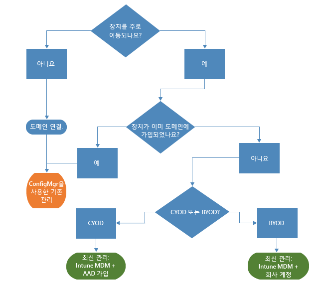
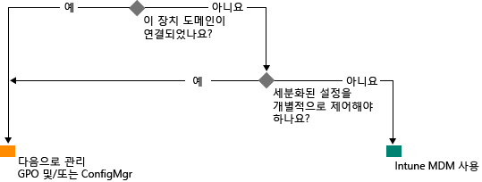

# Microsoft Intune을 사용한 최신 Windows 관리 경로

직원의 외근과 업무에 개인 장치 사용으로 인해 조직의 장치 관리 방식이 변하고 있습니다. 특정 하위 조직에서는 장치를 구체적이고 세부적으로 제어해야 하지만, 시나리오 기반의 가벼운 관리 방식을 수용하여 현대 직장인에게 더 많은 권한을 주는 조직도 있습니다.

Windows 10은 지금까지 Windows가 조직에 관리 효율성이 뛰어난 운영 체제를 제공해 온 전통을 이어갑니다. Windows는 그룹 정책, Active Directory, System Center Configuration Manager와 같은 기술을 통해 관리 효율성과 보안을 강화하도록 지원합니다. 또한 Microsoft EMS(Enterprise Mobility Suite) 같은 클라우드 기반 장치 관리 솔루션을 사용하여 "모바일 중심, 클라우드 중심" 접근 방식이라는 단순화되고 현대적인 관리 방식을 실현합니다. Windows as a Service를 통해 제공되는 혁신적인 Windows 차세대 기술이 Microsoft Intune, Azure Active Directory, Azure Rights Management Service, Office 365, 비즈니스용 Windows 스토어 같은 변화가 빠른 클라우드 서비스를 통해 기능이 보완됩니다.

IT 조직은 혁신과 비용 절감을 통해 다양한 이점을 얻을 수 있을 뿐 아니라 비즈니스의 유연성을 높일 수 있습니다. 이 문서에서는 Windows 10 배포 및 관리를 위한 전략 지침을 제공합니다. 또한 장치 관리 도구에 대한 Microsoft의 전략적 사고에 대한 핵심 정보도 제공합니다. 관리의 기본 내용과 그 내용을 서로 다른 장치에 적용할 방법을 생각할 때는 다음 장치 수명 주기 4단계를 고려하세요.

## 배포 및 프로비전

복잡한 IT 운영을 요구하는 전통적 OS 배포와 달리, 최신 장치 관리 방식은 "바로 관리"가 가능하게 해 줍니다. IT 부서는 새 장치를 이미지로 다시 설치 않고도 관리와 구성이 완벽한 장치로 손쉽게 변환하고자 합니다.  동적 프로비저닝이 Microsoft Intune와 같은 클라우드 기반 장치 관리 서비스를 통해 가능하게 되어 그 어느 때보다 쉽습니다. Windows ICD(Windows 이미징 및 구성 디자이너)로 빌드된 자체 포함 프로비저닝 패키지를 만들 수 있습니다. 물론, 기존 이미징 기술도 계속 지원되기 때문에 조직은 System Center Configuration Manager를 사용하여 사용자 지정 이미지를 배포할 수 있습니다.

## ID 및 인증

Windows 10과 Azure Active Directory와 같은 서비스가 클라우드 기반의 ID, 인증, 관리가 가능한 새로운 가능성을 열었습니다. BYOD, CYOD 같은 시나리오로 인해 기업은 사용자가 회사 리소스와 앱에 액세스하는 방법을 점검하게 되었습니다. 사용자와 장치 관리는 다음 두 범주에 속하는 것으로 볼 수 있습니다.

- Office 365와 같이 SaaS 앱용으로 모바일 사용자가 사용하는 회사(CYOD) 장치 또는 개인(BYOD) 장치.

  Windows 10에서는 직원이 장치를 자체 프로비전할 수 있습니다. 또한 회사 장치에서 Azure AD 조인으로 회사 액세스를 쉽게 설정할 수 있습니다. 또한 간소화된 새 BYOD 환경에서 Windows에 회사 계정을 추가하여 개인 장치에서 회사 리소스에 액세스할 수 있습니다. Azure AD 조인과 자동 Intune MDM 등록을 통합하여 [손쉽게 한 번에](https://blogs.technet.microsoft.com/ad/2015/08/14/windows-10-azure-ad-and-microsoft-intune-automatic-mdm-enrollment-powered-by-the-cloud/) 장치를 회사 관리 상태로 둘 수 있으며 클라우드에서 이 모든 작업을 할 수 있습니다. 또한 Azure AD 조인은 임시직 직원, 파트너 또는 기타 시간제 직원을 위한 훌륭한 솔루션입니다. 이러한 계정은 온-프레미스 AD 도메인과 별도로 관리할 수는 있지만 회사 리소스에 액세스해야 합니다.
- 인증이 필요한 전통적 응용 프로그램 및 리소스를 사용하고 아주 중요하거나 분류된 리소스 온-프레미스에 액세스하는 도메인 가입 PC와 태블릿

  Windows 10 장치를 온-프레미스 Active Directory 도메인에 연결하면 장치가 자동으로 Azure AD에 등록되기 때문에, 어디서나 가능한 클라우드와 온-프레미스 리소스로의 SSO(Single Sign-On), 엔터프라이즈 로밍 설정, Microsoft Passport for Work, Windows Hello 같은 Windows 10 환경의 추가 이점을 누릴 수 있습니다. 도메인 가입 PC와 태블릿은 계속해서 System Center Configuration Manager 클라이언트나 그룹 정책으로 관리해야 합니다.

조직에 설정된 역할을 검토합니다. 도메인 가입이 필요한 사용자나 장치를 확인하여 그 나머지는 Azure AD로 전환하는 것이 좋습니다. 다양한 장치를 사용하는 여러 시나리오에서 Windows 10과 Azure AD가 회사 리소스에 대한 액세스를 어떻게 최적화하는지 [이 문서](https://azure.microsoft.com/en-us/documentation/articles/active-directory-azureadjoin-windows10-devices/)에서 자세히 확인할 수 있습니다.

다음은 일반화된 의사 결정 트리를 도식화한 것입니다. 물론 경우에 따라 예외가 적용됩니다.

## 설정 및 구성

필요한 관리 수준, 관리할 장치 및 데이터, 업계 요구 사항을 모두 고려하여 구성 요건을 정의할 수 있습니다. 한편 직원은 IT 부서가 개인용 장치에 엄격한 정책을 적용하여 우려하기도 하지만 회사 메일과 문서에 액세스할 수 있기를 바랍니다. Windows 10은 공통 MDM 계층을 통해 PC, 태블릿, 휴대폰의 구성을 일관되게 해줍니다. MDM 접근 방식에서는 가능한 한 모든 설정을 노출하지 않고 관리자의 의도를 실현할 수 있는 설정이 필요합니다. 반면, 그룹 정책에서는 관리자가 개별적으로 조정하는 세부 설정을 노출합니다. MDM 이점 중 하나는 관리자가 광범위한 개인 정보 보호 설정, 보안 설정, 응용 프로그램 관리 설정을 빠르고 효율적인 도구를 통해 적용할 수 있다는 것입니다. 바로 이 점이 끊임없이 사용하는 장치에 MDM이 적합한 이유입니다.

아직도 도메인 가입 컴퓨터를 Internet Explorer의 GP 설정(구성 가능한 1,500개 설정), 특정 Windows 방화벽 규칙 등으로 세부적으로 관리해야 하는 조직이 많습니다. 이러한 경우에도 그룹 정책과 System Center Configuration Manager가 우수한 관리 옵션이 됩니다. 그룹 정책은 회사 네트워크에 연결된 Windows PC와 태블릿을 Windows 기반 도구를 사용하여 도메인 가입 방식으로 구성할 수 있는 훌륭한 방법입니다. Microsoft는 새로운 각 Windows 버전에 그룹 정책 설정을 계속해서 추가하고 있습니다. 강력한 소프트웨어 배포와 Windows 업데이트, OS 배포를 통해 세부적인 구성이 필요하다면 Configuration Manager가 적합합니다.

## Windows 장치 업데이트

Windows as a Service를 사용하면 IT 조직은 새 Windows가 각각 발표될 때마다 복잡한 이미징(제거 후 로드) 프로세스를 수행할 필요가 없습니다. CB(현재 분기)에서든 CBB(비즈니스용 현재 분기)에서든 장치가 간단한 패치 프로세스(자동으로 수행되기도 함)를 통해 최신 기능과 품질 업데이트를 받습니다. 또한 MDM과 Intune을 함께 사용하면 기업의 클라이언트 컴퓨터에 Windows 업데이트를 적용할 수 있는 다양한 도구를 갖게 됩니다. Configuration Manager도 유지 관리 기간, 자동 배포 규칙 같은 이러한 업데이트를 다양하게 관리하고 추적할 수 있는 기능을 제공합니다.

## 요약

조직에서 현대적인 장치 관리를 위한 계획을 세울 때 어떤 조치를 취하여 시작할 수 있는지 고려하세요.

1. **지금 바로 투자할 수 있습니다.** 기존의 장치 관리 항목 중 유지해야 하는 부분은 무엇이며 최신 기술로 현대화할 수 있는 부분은 무엇입니까? 사용자 지정 이미징을 최소화하거나 설정 관리를 다시 확인하거나 인증과 규정 준수를 재평가하기 위한 조치를 취하지 않아도, 다양한 이점을 바로 실현할 수 있습니다.

2. **환경에서 여러 사용 사례를 평가합니다.** 빠르고 간소화된 관리가 도움이 되는 장치 그룹이 있습니까? 예를 들어 BYOD 장치가 클라우드 기반 관리에 적합합니다. 규제가 심한 데이터를 처리하는 사용자나 장치가 인증에 온-프레미스 AD 도메인을 필요로 할 수 있습니다. Configuration Manager 및 EMS에서는 현대적인 관리 시나리오를 유연하게 구현하면서도, 비즈니스 요구에 가장 적합한 방식으로 여러 장치를 대상으로 지정할 수 있습니다. 경우에 따라 필요한 cmdlet을 사용하면 됩니다.

## 다음 단계

- **환경에 대한 관리 필요성 평가** 사용자, 이동성, 장치, 장치의 액세스 데이터에 따라 크기 하나로 모든 필요 사항을 충족할 수는 없습니다.
- **요구 사항을 고려합니다.** Windows 10, Configuration Manager, Enterprise Mobility Suite를 사용하여 어떤 시나리오에서도 유연하게 이미징, 인증, 설정 및 관리 도구를 처리할 수 있습니다.
- **소규모 조치를 취합니다.** 최신 장치 관리로 전환하기 위해 갑작스러운 변화를 줄 필요가 없습니다.
- **기존 투자를 최적화합니다.** 기존의 온-프레미스 관리 방식에서 클라우드 기반의 최신 관리 방식으로 전환하고 있다면 유연한 하이브리드 아키텍처인 Configuration Manager와 Intune을 활용하세요. Microsoft는 클라우드-ID/MDM 모델의 추가 기능을 제공하면서 기존 관리 방식에서 최신 관리 방식으로 명확하게 전환하는 방식을 제시하기 위해 노력합니다.

<!--HONumber=Sep16_HO2-->

