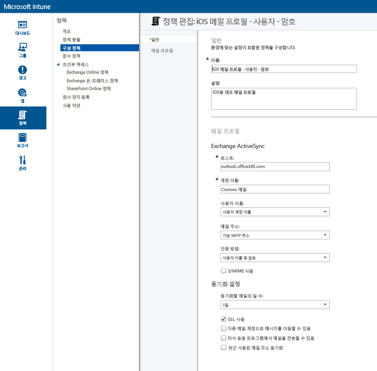
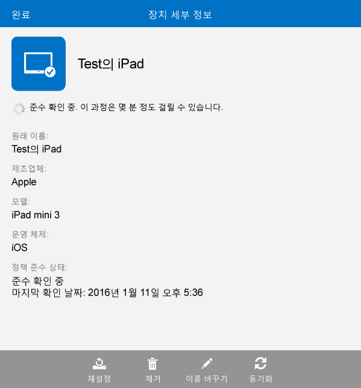

# Microsoft Intune を使って iOS デバイスに電子メール アクセスをセットアップする
デバイスが Intune に登録されている場合は、そのユーザーが会社の電子メールにアクセスできるようにデバイスを構成できます。 特定のデバイスの種類に対してこれを行う方法の 1 つは、**電子メール プロファイル**を作成して展開することです。 電子メール プロファイルは、ユーザーのデバイスをセットアップし、会社の電子メール サービスに接続する Intune ポリシーの一種です。
電子メール プロファイルを使用すると、登録済みのデバイスの電子メール アクセスが自動的に構成されるため、デバイスを手動で設定する必要がありません。 また、すべてのエンド ユーザーのアクセスが同じように同じ基本設定でセットアップされます。

## このチュートリアルの目的

- iOS デバイスの電子メール プロファイルを作成して展開するには
- 電子メール プロファイル ポリシーが正常に適用されていることを確認するには

## このチュートリアルを開始するために必要なもの

- Exchange Server (オンプレミスまたは Office/E3 サブスクリプションの一部として Azure でホストされている)。
- 会社の Exchange サーバーのホスト名。 これは、完全修飾ドメイン名 (FQDN) です (例: **contosodemo55.onmicrosoft.com**)。
- 電子メール プロファイルの展開先となるユーザー グループ。 「[Microsoft Intune の試用を開始し、iOS PIN ポリシーを展開する](start-a-microsoft-intune-trial-and-deploy-ios-pin-policy.md)」チュートリアルが完了している場合は、作成した **GroupDemo** ユーザー グループを使用できます。
- プロファイルの展開先となる登録済みの iOS デバイス。 これについても、「[Microsoft Intune の試用を開始し、iOS PIN ポリシーを展開する](start-a-microsoft-intune-trial-and-deploy-ios-pin-policy.md)」チュートリアルが完了している場合は、iOS デバイスが登録されています。

## iOS デバイスの電子メール プロファイルを作成して展開する手順

このチュートリアルでは、試用版サブスクリプションに付属しているホスト型 Exchange サーバーを使用します。
1. Intune コンソールで、**[ポリシー]** をクリックし、**[ポリシーの追加]** をクリックします。

2. **[新しいポリシーの作成]** ダイアログ ボックスで、**[iOS]** を展開し、**[電子メール プロファイル]** を選択して、**[ポリシーを作成する]** をクリックします。  

3. [ポリシーを作成する] ページで、ポリシーの名前 (**iOS email profile - user-password** など) および説明を入力します。 デバイスの種類や認証方法が異なる複数の電子メール プロファイルを作成できます。そのため、わかりやすいプロファイル名を付けることをお勧めします。
4. Exchange のホスト名を入力します。 ここでは、Azure でホストされている Exchange サーバーを使用しているため、次のようにホスト名を入力します: **outlook.office365.com**

5. 電子メール サービスを特定できるように、デバイスのユーザーに表示されるアカウント名を入力します。 たとえば、**Contoso Email** などです。
6. ここでは、ユーザー名とパスワードを使用して Exchange サービスに対してユーザーを認証するため、ユーザー名とパスワードの設定はそのままにします。
7. 要件に合わせて同期設定を調整します。 ここでは、特定の値に変更する必要がない限り、既定値を使用します。  
8. **[ポリシーの保存]** をクリックします。
9. ポリシーをすぐに展開するかどうかを確認するダイアログ ボックスが表示されます。 **[はい]** をクリックします。

10. 次に表示されるウィンドウで、電子メール プロファイルの展開先となるユーザー グループを選択し、**[追加]**、**[OK]** の順にクリックします。  
  
**[OK]** をクリックすると、ポリシーが 1、2 分で登録済みデバイスに適用されます。

## プロファイルが正常に適用されていることを確認する手順

プロファイルが適用されていることを確認するには、電子メール プロファイルを展開したデバイスのいずれかにアクセスする必要があります。
1. iOS デバイスで、メール アプリを開きます。
ユーザーの電子メールのユーザー名とパスワードの入力を求められます。  

2. ユーザーの Exchange 電子メール アカウントのユーザー名とパスワードを入力し、**[OK]** をタップします。
 メール アプリが開き、Exchange アカウントが表示され、デバイスへの電子メールの同期が開始されます。

3. メール アプリのアカウント設定で、アカウント名が電子メール プロファイルで指定したもの (たとえば、**Contoso Mail**) と同じかどうかと、同期の設定が正しいことを確認します。

  
  電子メール プロファイルがデバイスに自動的に適用されていない場合は、デバイスでポータル サイト アプリを使用して、ポリシーを手動で適用できます。
1. ポータル サイト アプリを開きます。
2. **[デバイス]** をタップします。
3. デバイスの名前をタップします。

4. **[同期]** > **[ポリシー準拠状況の確認]** をタップします。
 しばらくすると、電子メール プロファイルがデバイスに適用されます。 その後、検証手順に従って、プロファイルが正しく適用されているかどうかを確認できます。

## 関連項目
[Intune の評価ガイド](get-started-with-a-30-day-trial-of-microsoft-intune.md)

<!--HONumber=Jul16_HO4-->

