# Microsoft Intune の試用を開始し、iOS PIN ポリシーを展開する
ここでは、Intune 試用版のセットアップと、iOS デバイスの PIN ポリシーを構成する方法について、ステップ バイ ステップで説明します。 試用できるその他の一般的な Intune 評価タスクの一覧は、「[Microsoft Intune の一般的な評価タスク](common-microsoft-intune-evaluation-tasks.md)」をご覧ください。

## このタスクの前提条件を確認する

-   Internet Explorer を搭載した Windows PC (管理作業を実行する)

-   iOS 7.1 以降のデバイス (ユーザー ポリシーの検証をテストする)

-   携帯電話 (試用のサインアップ中に自分自身を認証する)

## Intune の無料の試用アカウントを作成する
> [!NOTE]
> 既に Intune サブスクリプションがある場合は、このセクションをスキップして次のセクションに進んでください。

1.  Windows PC を使用して、**Internet Explorer** (IE) を右クリックし、**[InPrivate ブラウズ]** を選びます。

    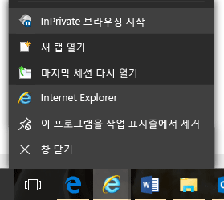

2.  [Intune のサインアップ ポータル](https://portal.office.com/Signup/Signup.aspx?OfferId=40BE278A-DFD1-470a-9EF7-9F2596EA7FF9&dl=INTUNE_A&ali=1)にアクセスし、必要な情報を入力して、**[次へ]** をクリックします。

    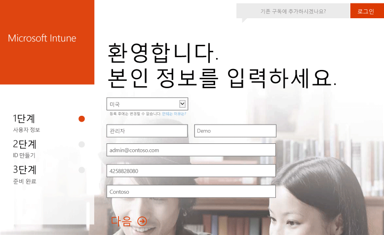

3.  管理者アカウントのユーザー ID とパスワードを入力し、**[次へ]** をクリックします。 今後は、この ID を使用して Intune ポータルにログインし、管理タスクを実行します。

    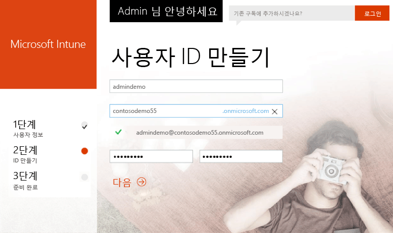

4.  携帯電話番号を入力し、**[テキスト メッセージを送信する]** をクリックして、携帯電話番号を検証します。

    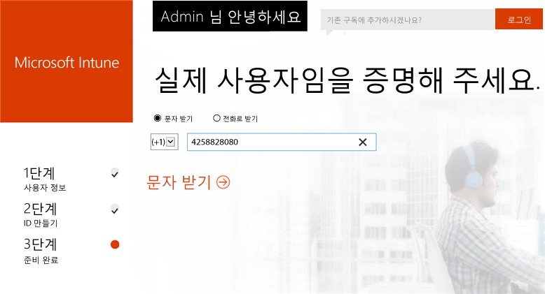

5.  画面に表示されている情報を保存し、**[準備ができました]** をクリックします。

    

## テスト ユーザーを作成する

1.  Windows PC を使用し、**[開始]** をクリックしてユーザーの管理ページに移動します。

    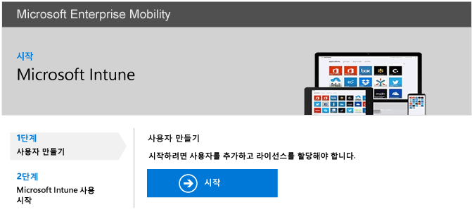

2.  **[+]** ボタンをクリックして、ユーザーを追加します。

    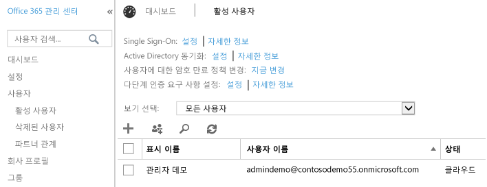

3.  **[新しいユーザー アカウントの作成]** ページで、次の手順を実行します。

    1.  テスト ユーザーの情報を指定します。

    2.  **[パスワードの入力]** オプションを選びます。

    3.  **[このユーザーが次にサインインした時にパスワードを変更する]** チェック ボックスをオフにします。

    4.  **[作成]** をクリックします。

    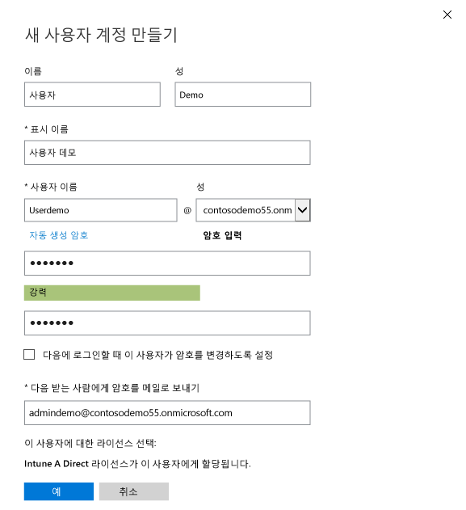

4.  ユーザー作成の確認ページで、**[閉じる]** をクリックします。

    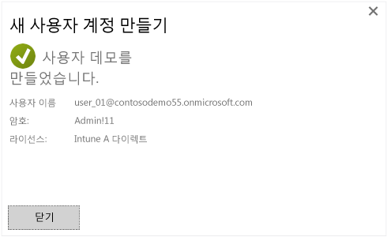

5.  **[最新の情報に更新]** ボタンをクリックして、作成したテスト ユーザーを表示します。

    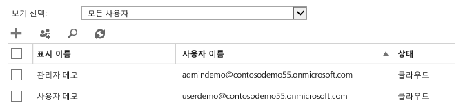

## テスト ユーザーの iOS PIN ポリシーを構成する

1.  Windows PC を使用して、Intune にする MDM 機関を設定します。

    1.  [Intune 管理コンソール](http://manage.microsoft.com/)に移動し、管理者アカウントでログインし、**[モバイル デバイスの管理を開始する]** をクリックします。 [モバイル デバイス管理機関] ページが開きます。

        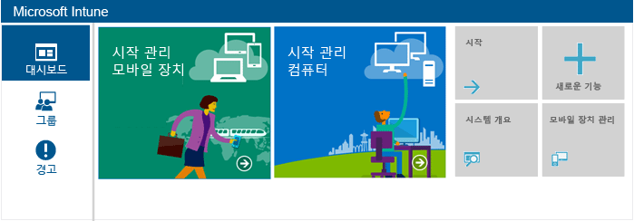

    2.  **[モバイル デバイス管理機関の設定]** リンクをクリックします。

        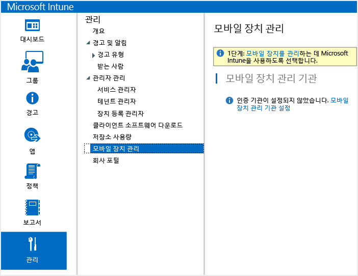

2.  iOS デバイスの登録を有効化します。 このプロセスは、Apple Push Notification サービス (APNs) と Intune サブスクリプションの間の信頼された証明書をセットアップします。

    1.  **[iOS および Mac OS X プラットフォームを有効にする]** をクリックします。

        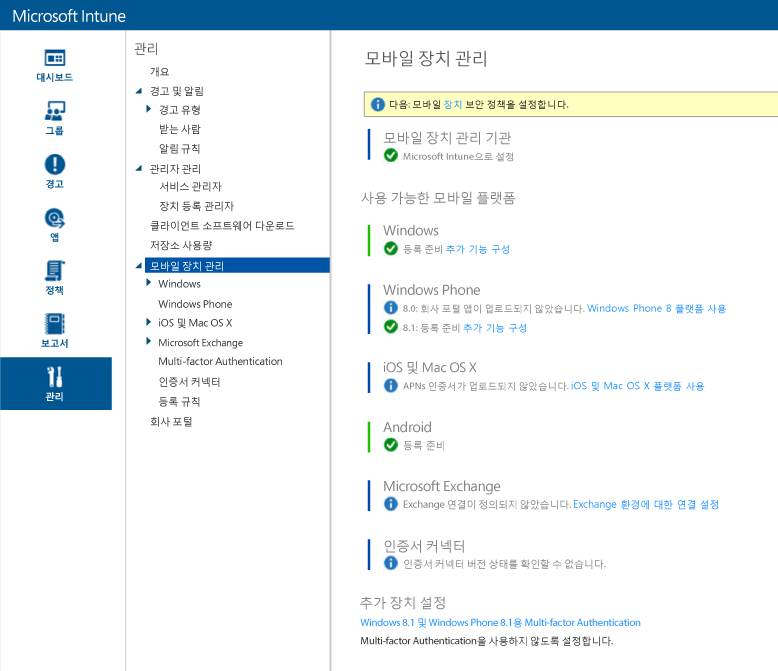

    2.  **[APNs 証明書要求のダウンロード]** をクリックします。

        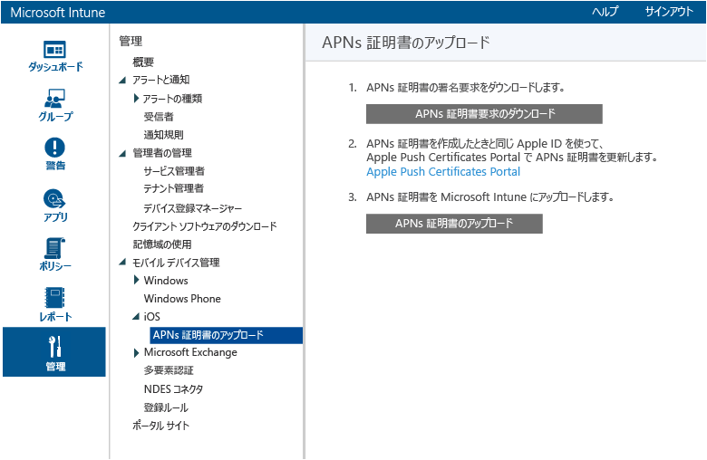

    3.  証明書署名要求 (CSR) のファイル名と場所を指定し、**[保存]** をクリックします。 このファイルは、Intune のサブスクリプションによって保持されている秘密キーに対応する公開キーを保持します。

        

    4.  **[Apple Push Certificates Portal]** をクリックして、新しいタブを開きます。

        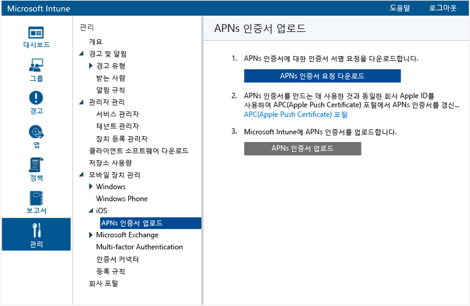

    5.  Apple ID とパスワードを入力し、**[サインイン]** をクリックします。 この ID には、iOS App Store からアプリを取得するために iOS デバイスで使用した ID を使うことができます。

        

    6.  **[証明書の作成]** をクリックします。

        

    7.  Apple の使用条件を読み、チェック ボックスを選び、**[同意する]** をクリックします。

        

    8.  **[参照]** をクリックします。

        

    9. 前に保存した CSR ファイルを選び、**[開く]** をクリックします。

        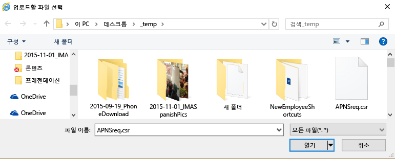

    10. **[アップロード]** ボタンをクリックします。

        

    11. JSON ファイルをダウンロードするメッセージが表示されたら、**[名前を付けて保存]** をクリックします。

        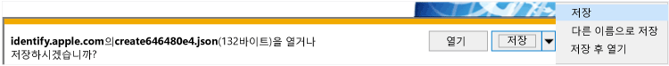

    12. JSON ファイルの場所を指定し、**[保存]** をクリックします。

        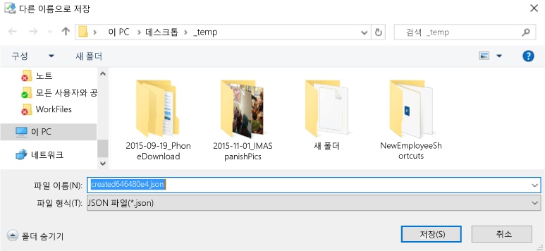

        数秒後にページが自動的にリダイレクトしない場合は、**[キャンセル]** をクリックします。

        

    13. 新しく作成された証明書ファイルを取得するには、**[ダウンロード]** をクリックします。

        

    14. PEM ファイルをダウンロードするメッセージが表示されたら、**[名前を付けて保存]** をクリックします。

        

    15. PEM ファイルの場所を指定し、**[保存]** をクリックします。

        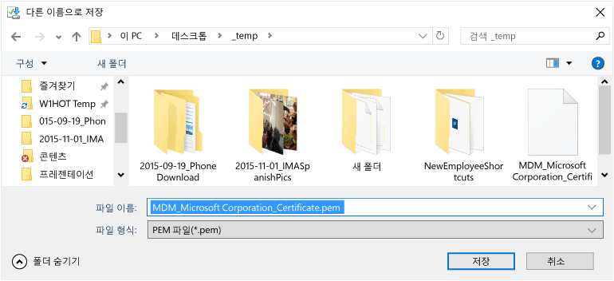

    16. Intune 管理コンソール タブに戻り、**[APNs 証明書のアップロード]** をクリックします。

        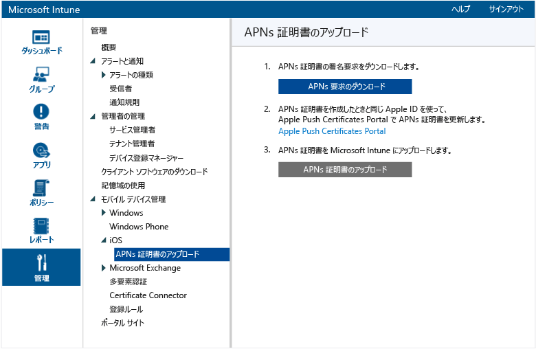

    17. Apple ID を入力し、**[参照]** をクリックします。

        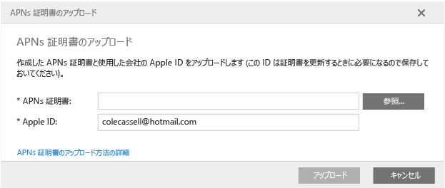

    18. いま保存した PEM ファイルを選び、**[開く]** をクリックします。

        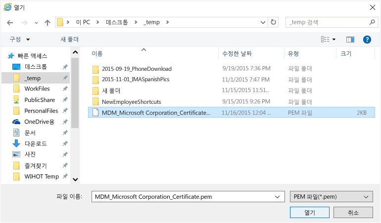

    19. **[アップロード]** をクリックします。

        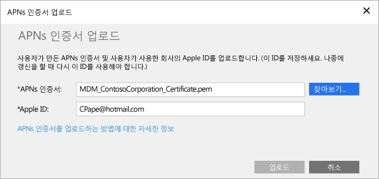

        これで、APNs 証明書が構成されました。

        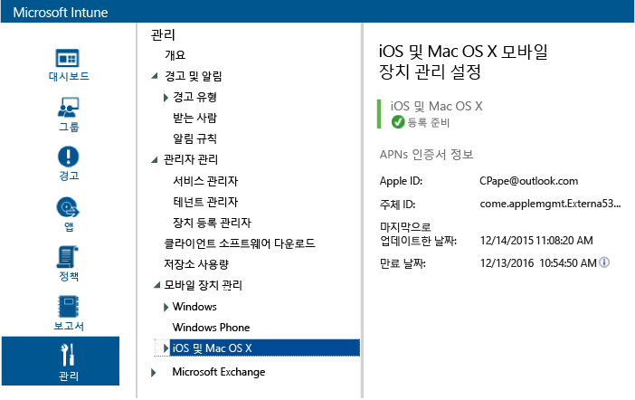

3.  ポリシーの対象とするテスト ユーザー グループを作成します。

    1.  左側のウィンドウで、**[グループ]** をクリックします。

        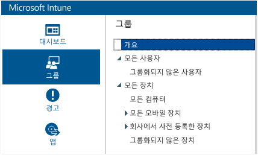

    2.  右端にある **[グループの作成]** をクリックします。

        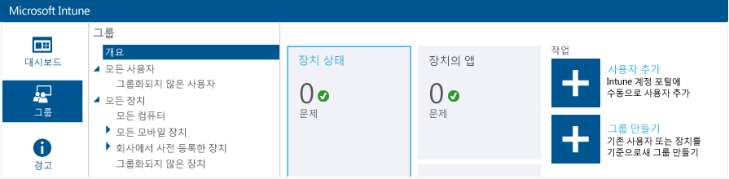

    3.  グループ名を指定し、親グループとして **[すべてのユーザー]** を選び、**[次へ]** をクリックします。

        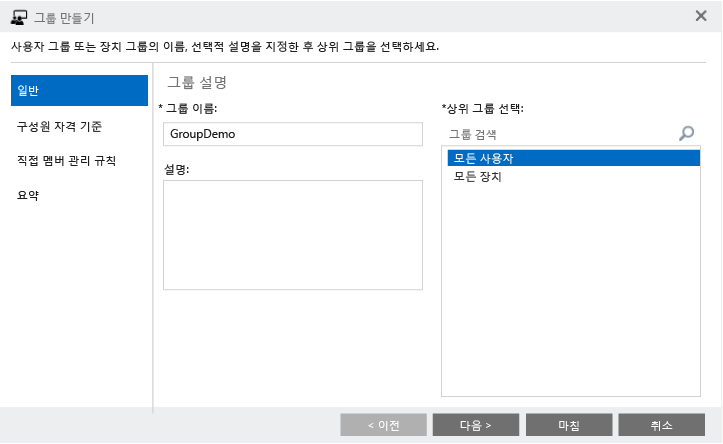

    4.  **[グループのメンバーシップ]** フィールドで **[親グループのすべてのユーザー]** を選び、**[完了]** をクリックします。

        

4.  iOS PIN ポリシーを作成し、テスト ユーザー グループを対象にします。

    1.  左側のウィンドウで **[ポリシー]** をクリックします。

        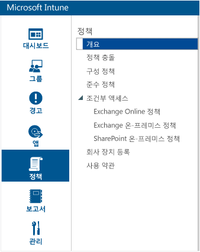

    2.  右端にある **[ポリシーの追加]** をクリックします。

        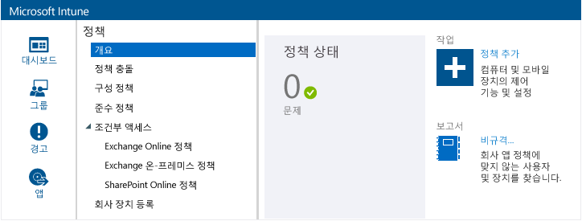

    3.  iOS のノードを展開し、**[全般構成]** の行を選び、**[ポリシーを作成する]** をクリックします。

        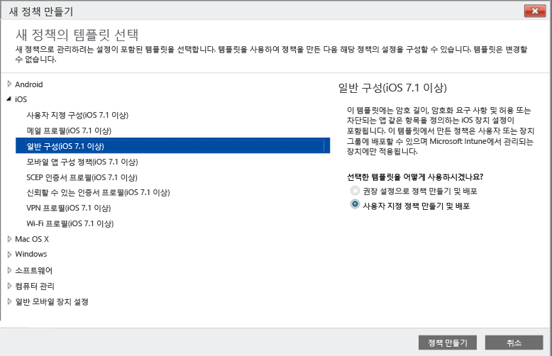

    4.  ポリシーの名前を入力し、**[モバイル デバイスのロック解除にパスワードを必要とする]** オプションをオンにし、**[パスワードの最小文字数]** を **4** に設定します。

        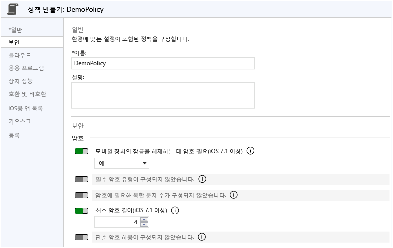

    5.  ポリシーを展開するには、**[はい]** をクリックします。

        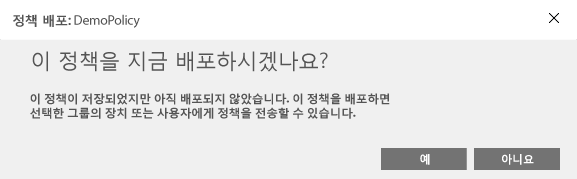

    6.  以前に作成したユーザー グループをクリックし、**[追加]** をクリックし、**[OK]** をクリックします。

        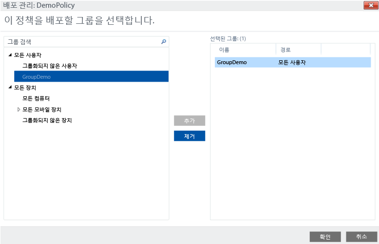

        これで、テスト ユーザー グループを対象とする iOS PIN ポリシーが完成しました。

        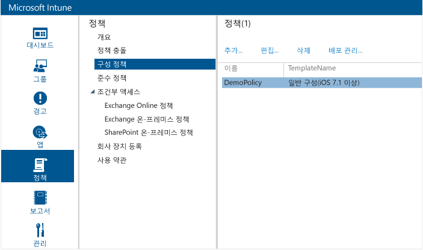

## iOS デバイスにポリシーが適用されていることを検証する

1.  iPad で、iOS App Store を起動し、無料の **Microsoft Intune ポータル サイト** アプリをインストールして、そのアプリを開きます。

    

2.  テスト ユーザー アカウント名とパスワードを入力し、**[サインイン]** をタップします。

    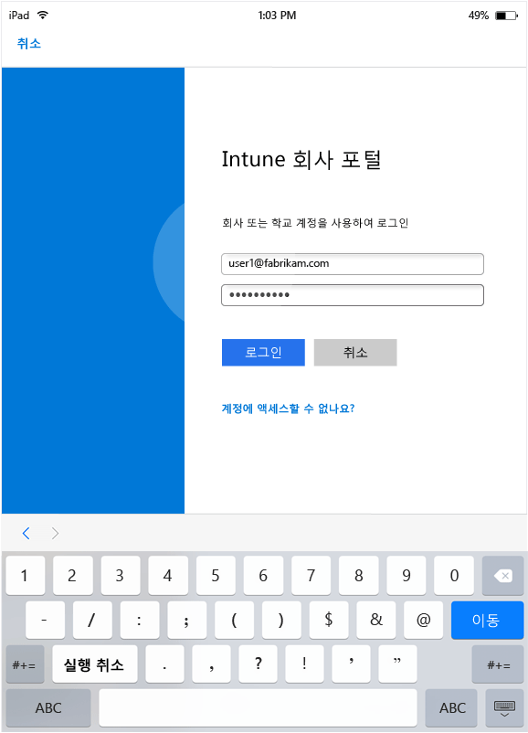

3.  **[登録]** をタップして、Intune でデバイスの登録を開始します。

    

4.  **[プロファイルのインストール]** 画面で、**[インストール]** をタップします。

    

5.  **[プロファイルのインストール]** ダイアログで、**[インストール]** をタップします。

    

6.  **[警告]** 画面で、**[インストール]** をタップします。

    

7.  **[リモート管理]** ダイアログで、**[信頼する]** をタップします。

    

8.  管理プロファイルのインストールが完了したら、**[完了]** をタップします。 これで、登録が完了しました。

    

9. 登録が完了したら、**[OK]** をタップし、ポータル サイト アプリを閉じます。

    ![[OK] をタップしてポータル サイト アプリを閉じる](../media/30-day-trial-walkthrus/30day-cfg-pol-53-devc-enrolled-ok.png)

10. パスコードを構成するようにとのメッセージが表示されたら、**[続行]** をタップします。

    

11. パスコードを入力し、**[続行]** をタップします。もう一度パスコードを入力し、**[保存]** をタップします。

    

12. 電源ボタンを押して iPad をロックし、スライドしてロックを解除します。このとき、デバイスのロックを解除するためにパスコードを入力する必要があることを確認してください。

### 関連項目
[Intune の評価ガイド](get-started-with-a-30-day-trial-of-microsoft-intune.md)

<!--HONumber=Jun16_HO4-->

