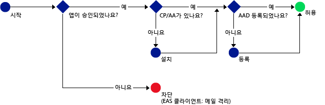

# Intune MAM 정책을 지원하는 모바일 앱만 Office 365 서비스에 액세스하도록 허용
[Intune MAM(모바일 앱 관리) 정책](protect-apps-and-data-with-microsoft-intune.md)을 사용하면 Intune에서 관리를 위해 등록된 장치에서 회사 데이터를 보호하는 데 도움이 됩니다. MAM 정책은 **Intune에서 관리를 위해 장치를 등록하지 않고 직원이 소유한 장치**에서 사용할 수도 있습니다.  이 경우 장치를 관리하지 않더라도 여전히 회사 데이터와 리소스가 보호되고 있음을 확인해야 합니다. MAM 조건부 액세스(MAM CA)를 사용하여 Intune MAM 정책을 지원하는 모바일 앱만 Exchange Online과 같은 Office 365 서비스 액세스가 허용되도록 정책을 만들 수 있습니다.

예를 들어 **Microsoft Outlook 앱**만 Exchange Online 액세스를 허용하면 **iOS 및 Android의 기본 제공 메일 앱을 차단**할 수 있습니다. 기본 제공 메일 앱에는 **Exchange Online**에서 메일을 가져올 수 있는 Intune MAM 정책의 데이터 보호 기능이 없습니다.

아래 다이어그램은 MAM CA 정책에서 액세스를 허용하거나 차단하는 경우를 결정하는 데 사용되는 흐름을 보여 줍니다. .

다이어그램에 사용된 약어 설명:
* **CP**: 회사 포털 앱
* **AA**: Azure Authenticator 앱
* **AAD**: Azure Active Directory
* **EAS**: Exchange Active Sync

## 필수 구성 요소
MAM CA 정책을 구성하려면 **먼저** **Enterprise Mobility + Security 또는 Azure Active Directory Premium 구독**을 사용하고 사용자는 EMS 또는 Azure AD의 라이선스를 취득해야 합니다. 자세한 내용은 [Enterprise Mobility 가격 책정 페이지](https://www.microsoft.com/en-us/cloud-platform/enterprise-mobility-pricing) 또는 [Azure Active Directory 가격 책정 페이지](https://azure.microsoft.com/en-us/pricing/details/active-directory/)를 참조하세요.

## 지원되는 앱
**Exchange Online**: Android 및 iOS용 **Microsoft Outlook**.

MAM CA 정책이 포함된 앱 관련 사용자 환경에 대한 자세한 내용은 [MAM CA가 적용된 앱을 사용할 경우 예상 결과](use-apps-with-mam-ca.md)를 참조하세요.

## 다음 단계
[MAM 앱에 대한 Exchange Online 정책 만들기](mam-ca-for-exchange-online.md)

[최신 인증이 없는 앱 차단](block-apps-with-no-modern-authentication.md)

### 참고 항목

[MAM 정책으로 앱 데이터 보호](protect-app-data-using-mobile-app-management-policies-with-microsoft-intune.md)

<!--HONumber=Oct16_HO4-->

