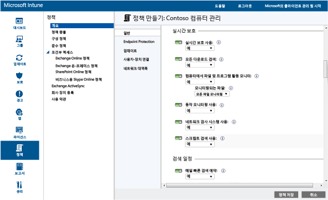

# Microsoft Intune용 Endpoint Protection을 사용한 Windows PC의 보안 유지 방법
Microsoft Intune은 맬웨어 위협으로부터 실시간으로 보호하고 맬웨어 정의를 최신으로 유지하며 컴퓨터를 자동으로 검색하는 Endpoint Protection 등의 관리 컴퓨터의 보안을 유지할 수 있습니다. 또한 Endpoint Protection은 맬웨어 공격의 관리 및 모니터링을 지원하는 도구도 제공합니다.

컴퓨터에 Intune 클라이언트를 아직 설치하지 않은 경우 [Microsoft Intune을 사용하여 Windows PC 클라이언트 설치](install-the-windows-pc-client-with-microsoft-intune.md) 항목을 참조하세요.

Endpoint Protection을 구성, 배포 및 모니터링하려면 다음 섹션의 정보를 참조하세요.

## Endpoint Protection을 사용하는 시기 선택
IT 관리자의 최우선 업무 중 하나는 관리하는 컴퓨터를 맬웨어와 바이러스로부터 보호하는 것입니다. 조직 내의 Windows PC에 Intune을 배포하기 전에 다음 옵션 중 하나를 선택하고 그와 관련한 정책 설정을 구성하여 컴퓨터를 보호하는 방법을 결정해야 합니다.

|다음 사항 필요|Endpoint Protection 정책 설정|추가 정보|
|--------------|---------------------------------------|--------------------|
|타사 끝점 보호 응용 프로그램이 설치되지 않은 경우에만 Microsoft Intune Endpoint Protection을 사용합니다.  타사 끝점 보호 응용 프로그램이 설치되지 않은 모든 컴퓨터에 Microsoft Intune Endpoint Protection을 사용할 수 있습니다.|Endpoint Protection 설치 = **예**  Endpoint Protection 사용 = **예**  타사 끝점 보호 응용 프로그램이 설치된 경우에도 Endpoint Protection 설치 = **아니요**|타사 끝점 보호 응용 프로그램이 감지된 경우 Microsoft Intune Endpoint Protection이 설치되지 않거나 이미 설치되었다면 제거됩니다.|
|타사 끝점 보호 응용 프로그램이 설치된 경우에도 Microsoft Intune Endpoint Protection을 사용합니다.  이 접근 방식에서는 Microsoft Intune Endpoint Protection과 타사 끝점 보호 응용 프로그램을 동시에 실행합니다. 이 구성은 성능 문제가 발생할 수 있으므로 사용하지 않는 것이 좋습니다. |Endpoint Protection 설치 = **예**  Endpoint Protection 사용 = **예**  타사 끝점 보호 응용 프로그램이 설치된 경우에도 Endpoint Protection 설치 = **예**|사용하는 경우:  -  Microsoft Intune Endpoint Protection 사용으로 전환하려고 합니다. -   Microsoft Intune Endpoint Protection을 사용할 새 클라이언트를 배포합니다. -  Microsoft Intune Endpoint Protection을 사용할 클라이언트를 업그레이드합니다.|
|Microsoft Intune Endpoint Protection 없이 Intune을 사용합니다. 대신 타사 끝점 보호 응용 프로그램을 사용합니다.|Endpoint Protection 설치 = **아니요**|타사 끝점 보호 응용 프로그램을 사용하지 않는 경우 이 구성은 조직의 컴퓨터를 맬웨어나 다른 공격에 노출시킬 수 있으므로 사용하지 않는 게 좋습니다.  Microsoft Intune Endpoint Protection이 설치되지 않으며 이전에 설치되었다면 제거됩니다.|
현재 끝점 보호 응용 프로그램에서 Microsoft Intune Endpoint Protection으로 전환하려면 다음을 수행합니다.

1.  해당 컴퓨터에 Intune 클라이언트 소프트웨어를 배포하는 동안 기존 끝점 보호 응용 프로그램이 실행되는 상태로 둡니다.

2.  Microsoft Intune Endpoint Protection이 설치되어 클라이언트 컴퓨터의 보호를 지원하는지 확인합니다.

3.  다음을 수행하여 타사 끝점 보호 소프트웨어를 제거합니다.

    -   Intune 소프트웨어 배포를 사용하여 타사 끝점 보호 응용 프로그램의 제조업체에서 제공한 소프트웨어 제거 도구를 배포합니다. 자세한 내용은 [Microsoft Intune을 사용하여 앱 배포](deploy-apps.md) 항목을 참조하세요.

    -   타사 끝점 보호 응용 프로그램을 수동으로 제거합니다.

> [!NOTE]
> Intune은 타사 끝점 보호 응용 프로그램을 자동으로 제거하지 않습니다.

## Microsoft Intune Endpoint Protection 구성
다음 단계를 사용하여 Microsoft Intune용 Endpoint Protection을 구성할 수 있습니다.

1.  [Microsoft Intune 관리 콘솔](https://manage.microsoft.com/)에서 **정책** > **정책 추가**를 선택합니다.

2.  **컴퓨터 관리**를 확장한 후 **Microsoft Intune 에이전트 설정**을 선택합니다. **사용자 지정 정책 만들기 및 배포**를 선택하여 Endpoint Protection 설정에 대한 정책을 지정합니다. 그런 다음 **정책 만들기** 단추를 선택합니다.

권장 설정을 사용하거나 설정을 사용자 지정할 수 있습니다. 정책을 만들고 배포하는 방법에 대한 자세한 정보가 필요한 경우 [Microsoft Intune 컴퓨터 클라이언트를 사용한 일반 Windows PC 관리 작업](common-windows-pc-management-tasks-with-the-microsoft-intune-computer-client.md) 항목을 참조하세요.

  

**정책** 작업 영역의 **모든 정책** 페이지에서 배포된 Endpoint Protection 정책을 확인할 수 있습니다.

## Endpoint Protection 서비스 설정 지정

|정책 설정|세부 정보|
|------------------|--------------------|
|**Endpoint Protection 설치**|관리 컴퓨터에 Endpoint Protection을 설치하려면 **예**로 설정합니다. 설치 중에 타사 끝점 보호 응용 프로그램이 검색된 경우 설정 **타사 끝점 보호 응용 프로그램이 설치된 경우에도 Endpoint Protection 설치**가 **예**로 설정되어 있지 않으면 Endpoint Protection이 설치되지 않습니다. **참고:** Intune Endpoint Protection은 관리 컴퓨터에 기본적으로 설치됩니다. 관리 컴퓨터에 Endpoint Protection을 설치하지 않으려면 명시적으로 이 정책을 **아니요**로 설정해야 합니다. 이전에 Endpoint Protection을 설치했는데 정책을 **아니요**로 업데이트하면 Endpoint Protection 클라이언트가 제거됩니다. 권장 값: **예**|
|**타사 끝점 보호 앱이 설치된 경우에도 Endpoint Protection 설치**|타사 끝점 보호 응용 프로그램이 검색된 경우에도 **예**로 설정하여 Microsoft Intune Endpoint Protection을 설치합니다.  권장 값: **예**|
|**Endpoint Protection 사용**|**예**로 설정하여 Endpoint Protection 클라이언트가 있는 컴퓨터에서 Microsoft Intune Endpoint Protection을 활성화합니다.  **아니요**로 설정하고 Microsoft Intune Endpoint Protection을 설치하는 경우 Endpoint Protection 클라이언트 사용자 인터페이스가 사용자에게 표시되지 않으며 모든 보호 기능이 비활성화됩니다.  권장 값: **예**|
|**클라이언트 UI 사용 안 함**|사용자에게 Microsoft Intune Endpoint Protection 클라이언트 사용자 인터페이스를 숨기려면 **예**로 설정합니다(클라이언트 컴퓨터를 다시 시작해야 적용됨).  권장 값: **아니요**|
|**타사 끝점 보호 앱이 설치된 경우에도 Endpoint Protection 설치**|타사 끝점 보호 응용 프로그램이 검색된 경우에도 Microsoft Intune Endpoint Protection을 강제로 설치하려면 **예**로 설정합니다.  권장 값: **아니요**|
|**맬웨어 치료 전에 시스템 복원 지점 만들기**|맬웨어 치료를 시작하기 전에 Windows 시스템 복원 지점을 만들려면 **예**로 설정합니다.  권장 값: **예**|
|**해결된 맬웨어 추적(일)**|Endpoint Protection에서 지정한 시간 동안에 해결된 맬웨어를 추적하므로 이전에 감염된 컴퓨터를 수동으로 검사할 수 있습니다.  0 - 30일의 값을 지정할 수 있습니다.  권장 값: **7일**|
**Endpoint Protection 설치** 및 **Endpoint Protection 사용** 설정에 대한 정책 값을 **예**로 설정하고 **타사 끝점 보호 응용 프로그램이 설치된 경우에도 Endpoint Protection 설치**에 대한 정책 값을 **아니요**로 설정하면, Microsoft Intune Endpoint Protection은 다른 끝점 보호 응용 프로그램이 설치된 것으로 감지합니다. 즉, Endpoint Protection이 설치되지 않으며 이미 있는 경우 제거됩니다. 하지만 Intune의 Microsoft Intune Endpoint Protection은 다른 끝점 보호 응용 프로그램의 상태를 보고합니다.

  바이러스 및 스파이웨어와 같은 잠재적인 위협 요소가 PC에서 자체 설치 또는 실행하려고 할 때 Microsoft Security Essentials에서 실시간 보호로 경고를 보냅니다. 이 문제가 발생하는 순간 작업 표시줄의 오른쪽 알림 영역에 메시지가 표시됩니다.

### 실시간 보호 설정 지정

|정책 설정|세부 정보|
|------------------|--------------------|
|**실시간 보호 사용**|액세스되는 모든 파일과 응용 프로그램의 모니터링 및 검사를 사용하도록 설정합니다. 악성 파일 및 응용 프로그램이 컴퓨터에서 실행되기 전에 차단합니다.  권장 값: **예**|
|**모든 다운로드 검색**|인터넷에서 컴퓨터로 다운로드되는 모든 파일과 첨부 파일의 검색을 사용하도록 설정합니다.  권장 값: **예**|
|**컴퓨터에서 파일 및 프로그램 활동 모니터**|컴퓨터에서 들어오는 파일과 나가는 파일 및 프로그램 활동을 모니터링하도록 설정합니다. 이 설정을 통해 Endpoint Protection은 파일 및 프로그램이 실행되기 시작할 때 모니터링하여 파일 및 프로그램이 수행하거나 영향 받는 모든 작업에 대해 경고를 보낼 수 있습니다.  권장 값: **예**|
|**모니터링되는 파일**|들어오는 파일만 모니터링할지, 나가는 파일만 모니터링할지 또는 모든 파일을 모니터링할지 선택할 수 있습니다.  권장 값: **모든 파일 모니터링**|
|**동작 모니터링 사용**|Microsoft Intune Endpoint Protection에서 클라이언트 컴퓨터의 특정한 의심스러운 활동 패턴을 확인할 수 있습니다.  권장 값: **예**|
|**네트워크 검사 시스템 사용**|클라이언트 컴퓨터에서 NIS(네트워크 검사 시스템)를 사용하도록 설정합니다. NIS는 [Microsoft Malware Protection Center(Microsoft 맬웨어 보호 센터)](http://go.microsoft.com/fwlink/?LinkId=234249) 에서 알려진 취약점의 서명을 사용하여 악성 네트워크 트래픽을 탐색하고 차단합니다.  권장 값: **예**|

  

### 검색 예약 설정 지정

|정책 설정|추가 정보|
|------------------|--------------------|
|**매일 빠른 검색 예약**|컴퓨터에서 자주 사용되는 파일과 중요한 시스템 파일에 대한 매일 빠른 검색을 예약합니다. 이 빠른 검색은 성능에 미치는 영향을 최소화합니다.  권장 값: **예**|
|**2회 연속 검색을 하지 못한 경우 빠른 검색 실행**|2회 연속 빠른 검색을 수행하지 못한 경우 빠른 검색을 자동으로 실행하도록 Endpoint Protection을 구성합니다.  권장 값: **예**|
|**전체 검색 예약**|로컬 컴퓨터 하드 디스크에 있는 모든 파일 및 리소스에 대한 전체 검색을 구성합니다. 이 검색은 시간이 걸릴 수 있으며 컴퓨터 성능에 영향을 줍니다(검색 대상 파일 수와 리소스 수에 따라 다름).  권장 값: **아니요**|
|**2회 연속 전체 검색을 하지 못한 경우 전체 검색 실행**|2회 연속 검색을 수행하지 못한 경우 전체 검색을 자동으로 실행하도록 Endpoint Protection을 구성합니다.  권장 값: 구성되지 않음|

### 검색 옵션 설정 지정

|정책 설정|세부 정보|
|------------------|--------------------|
|**Endpoint Protection 설치 후 전체 검색 실행**|컴퓨터에 Endpoint Protection을 설치한 이후에 전체 시스템 검색을 자동으로 실행하도록 하려면 **예**로 설정합니다. 이 검색은 사용자 생산성에 미치는 영향을 최소화하기 위해 컴퓨터가 유휴 상태일 때만 실행됩니다.  권장 값: **예**|
|**맬웨어 제거 추가 작업으로 필요한 경우 자동으로 전체 검색 실행**|맬웨어를 제거한 후 다른 파일이 감염되지 않았는지 확인하기 위해 Endpoint Protection이 컴퓨터의 전체 시스템 검색을 자동으로 실행하도록 하려면 **예**로 설정합니다.  권장 값: **예**|
|**컴퓨터가 유휴 상태일 때에만 예약된 검색 시작**|사용자 생산성 손실을 방지하기 위해 컴퓨터가 사용 중일 때에는 예약 검색을 실행하지 않도록 하려면 **예**로 설정합니다.  권장 값: **예**|
|**검색을 시작하기 전에 최신 맬웨어 정의 확인**|컴퓨터에서 검색을 시작하기 전에 Endpoint Protection이 최신 맬웨어 정의를 자동으로 확인하도록 하려면 **예**로 설정합니다.  권장 값: **예**|
|**보관 파일 검색**|컴퓨터의 보관 파일(예: .zip 또는 .cab 파일)에 대해 맬웨어를 검색하도록 Endpoint Protection을 구성하려면 **예**로 설정합니다.  권장 값: **아니요**|
|**메일 메시지 검색**|들어오는 전자 메일 메시지가 컴퓨터에 도착할 때 해당 메시지를 검색하도록 Endpoint Protection을 구성하려면 **예**로 설정합니다.  권장 값: **예**|
|**네트워크 공유 폴더의 열린 파일 검색**|네트워크의 공유 폴더에서 연 파일을 검색하도록 Endpoint Protection을 구성하려면 **예**로 설정합니다. 이러한 파일은 일반적으로 UNC(범용 명명 규칙) 경로를 사용하여 액세스되는 파일입니다. 이 기능을 사용하도록 설정하면 읽기 전용 권한을 가진 사용자의 경우 맬웨어를 제거할 수 없어 문제가 될 수 있습니다.  권장 값: **아니요**|
|**매핑된 네트워크 드라이브 검색**|**예**로 설정하여 매핑된 네트워크 드라이브의 파일을 검색하도록 Endpoint Protection을 구성합니다. 이 기능을 사용하도록 설정하면 읽기 전용 권한을 가진 사용자의 경우 맬웨어를 제거할 수 없어 문제가 될 수 있습니다.  권장 값: **아니요**|
|**이동식 드라이브 검색**|컴퓨터에서 전체 검색을 실행할 때 USB 플래시 드라이브와 같은 이동식 드라이브에서 맬웨어와 사용자 동의 없이 설치된 소프트웨어를 검색하도록 Endpoint Protection을 구성하려면 **예**로 설정합니다.  권장 값: **예**|
|**검색하는 동안 CPU 사용 제한**|컴퓨터에서 예약된 검색을 하는 동안 사용할 수 있는 CPU 사용의 최대 비율을 설정합니다. 이 값은 1 - 100%로 설정할 수 있습니다.  권장 값: **50%**|

### 기본 작업 설정 선택

설정 **다음 경고 수준의 맬웨어에 대한 Endpoint Protection의 작업 방식 선택**은 다양한 경고 수준의 멜웨어가 검색될 때 Endpoint Protection이 취하는 기본 작업을 지정합니다. 각 경고 수준에 대해 맬웨어를 제거 또는 격리하거나 Microsoft의 권장 작업을 수행할 수 있습니다.

권장 값: **권장 작업**. 이를 설정하면 Endpoint Protection에서 작업을 권장해 줍니다.   

### 파일 및 폴더 제외 설정을 선택할지 결정

설정 **검색을 실행하거나 실시간 보호를 사용할 때 제외할 파일 및 폴더**는 컴퓨터에서 검색을 실행하거나 실시간 보호를 사용할 때 특정 파일 또는 폴더를 제외합니다.

### 프로세스 제외 설정을 선택할지 결정

설정 **검색을 실행하거나 실시간 보호를 사용할 때 제외할 프로세스**는 컴퓨터에서 검색을 실행하거나 실시간 보호를 사용할 때 특정 파일 확장명을 제외할 수 있습니다. 확장명이 **.exe**, **.com** 또는 **.scr**인 파일만 제외할 수 있습니다.

### 파일 형식 제외 설정을 선택할지 결정

**검색을 실행하거나 실시간 보호를 사용할 때 제외할 파일 확장명** 설정을 통해 컴퓨터에서 검색을 실행하거나 실시간 보호를 사용할 때 특정 파일 이름 확장명을 제외할 수 있습니다.

### Microsoft 활성 보호 서비스 설정 지정
Microsoft 활성 보호 서비스는 잠재적 위협에 대응하는 방법을 결정하는 데 도움이 되는 온라인 커뮤니티입니다. 또한 이 커뮤니티는 새로운 맬웨어 감염의 전파를 막는 데도 도움이 됩니다. **예**를 선택한 다음 **회원 수준**을 지정하여 **Microsoft 활성 보호 서비스에 가입**할 수 있습니다.
  - **기본** - 검색된 맬웨어 대한 기본 정보를 Microsoft로 전송합니다. 기본 정보에는 소프트웨어가 들어온 위치, 사용자가 적용한 또는 Endpoint Protection에서 자동으로 적용한 작업, 작업의 성공 여부 등이 포함됩니다.
  - **고급** - 맬웨어, 스파이웨어 및 사용자 동의 없이 설치된 소프트웨어에 대한 추가 정보를 Microsoft로 전송합니다. 여기에는 소프트웨어 위치, 파일 이름, 소프트웨어의 작동 방식, 컴퓨터에 미친 영향 등에 대한 정보가 있습니다.

**Microsoft 활성 보호 서비스 보고서를 기반으로 하여 동적 정의 받기**도 가능합니다.

## Endpoint Protection의 관리 작업 선택
다음 작업을 통해 Endpoint Protection을 실행하는 관리 컴퓨터에서 다양한 관리 작업을 쉽게 수행할 수 있습니다.
 - 맬웨어 정의 업데이트
  - Intune 콘솔 - **그룹** 작업 영역에서 업데이트할 컴퓨터를 선택합니다. **원격 작업** &gt; **맬웨어 정의 업데이트**를 선택합니다.
  - 관리 컴퓨터 - Windows 알림 영역에서 Endpoint Protection 클라이언트 소프트웨어를 시작합니다. **업데이트** 탭을 선택한 다음 **업데이트**를 선택합니다.
 - 맬웨어 검색 실행:
  - Intune 콘솔 - **그룹** 작업 영역에서 검색할 컴퓨터를 선택합니다. **전체 맬웨어 검색 실행** 또는 **빠른 맬웨어 검색 실행**을 선택합니다.
  - 관리 컴퓨터 - Windows 알림 영역에서 Endpoint Protection 클라이언트 소프트웨어를 시작합니다. **빠른**, **전체**또는 **사용자 지정**을 선택한 후 **지금 검색**을 선택합니다.

Intune 콘솔의 오른쪽 아래 모서리에 있는 **원격 작업** 링크를 선택하여 원격 작업의 상태를 확인할 수 있습니다. **원격 작업 상태** 대화 상자에는 현재 원격 작업, 작업 상태, 장치 이름 및 보고된 모든 오류가 표시됩니다. 또한 문제 해결 정보에 대한 링크(해당하는 경우)도 나와 있습니다.

## Endpoint Protection 모니터링
[Microsoft Intune 관리 콘솔](https://manage.microsoft.com/) 의 **보호**작업 영역을 사용하여 컴퓨터의 맬웨어 상태를 모니터링할 수 있습니다. 이 작업 영역에는 다음 두 페이지가 포함되어 있습니다.
 - **보호 개요** - 추가 정보를 보기 위해 선택할 수 있는 링크로 중요 정보를 표시합니다. 표시되는 문제는 다음과 같습니다.
  - **추가 작업이 필요한 맬웨어 인스턴스** – 문제를 해결하기 위해 수행해야 하는 추가 작업이 포함된 맬웨어 문제 목록을 보려면 이 링크를 클릭합니다. 이 목록을 탐색하여 영향 받는 컴퓨터를 확인할 수 있습니다.
  - **추가 작업이 필요한 맬웨어 인스턴스** – 문제를 해결하기 위해 수행해야 하는 추가 작업뿐만 아니라 해결되지 않은 맬웨어 문제 목록을 보려면 이 링크를 클릭합니다.
  - **보호되지 않는 장치** – 소프트웨어가 설치되어 있지 않거나 오류가 발생하여 끝점 보호 소프트웨어에서 보호하지 않는 컴퓨터를 보려면 이 링크를 클릭합니다. 자세한 내용을 보려면 컴퓨터를 선택하세요.
  - **다른 끝점 보호 응용 프로그램을 실행 중인 장치** – 타사 끝점 보호 응용 프로그램을 실행하는 컴퓨터를 보려면 이 링크를 클릭합니다.
 - **모든 맬웨어** - 컴퓨터에서 검색된 모든 활성 맬웨어 목록을 표시합니다. 이 목록을 탐색하여 특정 맬웨어로 검색되는 모든 컴퓨터를 보거나 다음 작업 중 하나를 선택할 수 있습니다.
  - **속성 보기** – 선택한 맬웨어에 대한 추가 정보가 포함된 페이지를 엽니다.
  - **이 맬웨어에 대한 자세한 정보** – 맬웨어에 대한 추가 정보가 포함된 Microsoft 맬웨어 보호 센터의 항목을 엽니다.

> [!IMPORTANT]
> **보호** 작업 영역은 클라이언트를 설치하고 하나 이상의 컴퓨터 클라이언트를 관리하게 될 때까지 관리 콘솔에 표시되지 않습니다.

  

### 컴퓨터에서 맬웨어에 대한 최근 검색 경로를 보는 방법
Intune은 장치에서 맬웨어의 최근 검색된 인스턴스 최대 10개에 대한 경로를 표시할 수 있습니다. **최근 검색 경로**는 기본적으로 비활성화되어 있습니다. 이 보기를 사용하려면:

1. [Microsoft Intune 관리 콘솔](https://manage.microsoft.com/)에서 **그룹** > **모든 장치** > **모든 컴퓨터**를 선택합니다.
2. 최근 검색 경로를 확인할 컴퓨터를 마우스 오른쪽 단추로 클릭하고 **속성**을 선택합니다.
3. 맨 위의 탭에서 **맬웨어**를 선택합니다.

   
4. 열 머리글을 마우스 오른쪽 단추로 클릭합니다. 사용 가능한 열 목록이 표시됩니다. 목록에서 **최근 검색 경로** 확인란을 선택합니다. **최근 검색 경로** 열에 장치에서 최근에 모니터링한 맬웨어를 최대 10개 표시합니다.

## 컴퓨터에서 맬웨어 검색 실행 또는 맬웨어 정의 업데이트
Intune은 Intune 클라이언트가 설치된 원격 관리 PC에서 Endpoint Protection 또는 Windows Defender를 사용하여 전체 또는 빠른 맬웨어 검색을 실행할 수 있습니다.

1. [Microsoft Intune 관리 콘솔](https://manage.microsoft.com/)에서 **그룹** > **개요** > **모든 장치** > **모든 컴퓨터**로 이동하여 대상으로 지정할 컴퓨터를 선택합니다.

2. **원격 작업** 드롭다운 목록을 선택한 후 원격 컴퓨터에서 실행할 작업을 선택합니다.

## 도움이 더 필요하신가요?
추가적인 도움말과 지원은 [Microsoft Intune에서 Endpoint Protection 문제 해결](/intune/troubleshoot/troubleshoot-endpoint-protection-in-microsoft-intune) 항목을 참조하세요.

### 참고 항목
[Windows PC를 보호하는 정책](policies-to-protect-windows-pcs-in-microsoft-intune.md)

