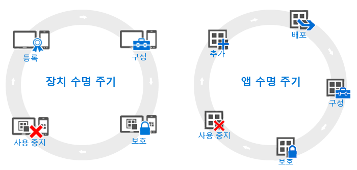

# 장치 및 앱 수명 주기에 대한 개요

[!INCLUDE[classic-portal](../includes/classic-portal.md)]

개별 조직의 필요는 다를 수 있지만 모든 조직이 다른 운영 요구가 무엇이든 수시로 실행해야 하는 특정 일반적인 단계가 있습니다. 이러한 단계를 **수명 주기**라는 두 가지 주요 범주로 그룹화할 수 있습니다. 수행하는 배포 수명 주기는 사용하려는 시나리오에 따라 달라집니다. 예를 들어 장치 수명 주기와 앱 수명 주기 중 하나만 필요할 수도 있고 둘 다 필요할 수도 있습니다.

관리 목적을 위해 모든 장치에는 수명 주기가 있습니다. 수명 주기는 장치를 등록할 때부터 사용이 중지될 때까지의 기간입니다. [장치 관리 수명 주기](overview-of-device-lifecycle-in-microsoft-intune.md)에서는 장치를 등록하는 방법, 장치를 구성하고 보호하는 방법 및 관리 대상에서 장치를 제거하는 방법을 안내합니다.

마찬가지로 작업하는 앱은 Intune에 앱 추가에서 더 이상 필요 없을 때 제거할 때까지 모든 단계를 포함하는 고유 [앱 수명 주기](overview-of-app-lifecycle-in-microsoft-intune.md)를 가지고 있습니다.

<!--HONumber=Dec16_HO5-->

