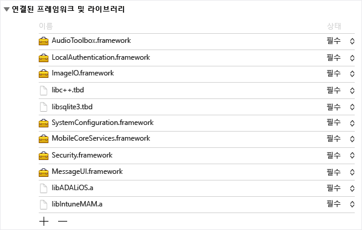
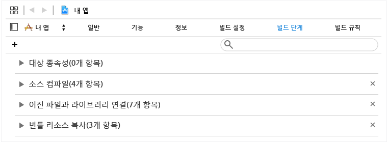
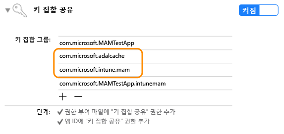

# iOS 用 Microsoft Intune アプリ SDK 開発者ガイド

> [!NOTE]
> 最初に、「[Intune アプリ SDK の概要ガイド](intune-app-sdk-get-started.md)」に目を通すことをお勧めします。このガイドでは、サポートする各プラットフォームで統合のための準備をする方法について説明しています。* 

iOS 用 Microsoft Intune アプリ SDK を使用すると、iOS アプリに Intune モバイル アプリ管理 (MAM) を組み込むことができます。 MAM 対応アプリケーションは Intune アプリ SDK に統合され、これにより IT 管理者は、アプリをアクティブに管理する場合にモバイル アプリにポリシーを展開できます。

# SDK の機能

iOS 用 Intune アプリ SDK には、スタティック ライブラリ、リソース ファイル、API ヘッダー、デバッグ設定 plist および構成ツールが含まれています。 ほとんどのポリシー適用では、モバイル アプリに単にリソース ファイルを含め、ライブラリに静的にリンクできます。 高度な Intune MAM 機能は、API を介して適用されます。
このガイドでは、iOS 用 Intune アプリ SDK を統合するときに次のものを使用する方法について説明します。

* **`libIntuneMAM.a`**: Intune アプリ SDK ライブラリ このライブラリをプロジェクトにリンクして、モバイル アプリを MAM 対応にします。 手順については、このガイドの「Intune アプリ SDK を使用したアプリの構築」のセクションを参照してください。

* **`IntuneMAMResources.Bundle`**: SDK が依存するリソースが含まれているリソース バンドル。 

* **ヘッダー**: Intune アプリ SDK の API を表示します。 API を使用する場合は、API を含むヘッダー ファイルをインクルードする必要があります。 

# Intune アプリ SDK のしくみ

iOS 用 Intune アプリ SDK の目的は、最小限のコード変更で iOS アプリケーションに管理機能を追加することです。 コード変更の量を減らすと、製品化に要する時間が短縮される一方で、モバイル アプリケーションの一貫性と安定性が向上します。 

アプリケーションをスタティック ライブラリにリンクして、リソース バンドルを含める必要があります。 MAMDebugSettings.plist ファイルはオプションです。Microsoft Intune を使用してアプリケーションを展開する必要なく、アプリケーションに適用される MAM ポリシーをシミュレートするために、パッケージに含めることができます。 さらに、デバッグ ビルドでは、iTunes のファイル共有を使用して、アプリケーションの Documents ディレクトリに MAMDebugSettings.plist ファイルを転送することで、MAMDebugSettings.plist ファイル内のポリシーを適用できます。

# Intune アプリ SDK を使用したアプリの構築 

Intune アプリ SDK を有効にするには、次の手順に従います。

1. 次の手順に従って、 `libIntuneMAM.a` ライブラリにリンクします。

    libIntuneMAM.a ライブラリをプロジェクト ターゲットの [リンク先フレームワークおよびライブラリ] ボックスの一覧にドラッグ アンド ドロップします。  

    
 
    **注**: アプリ ストアにリリースする場合は、デバッグ バージョンではなく、リリース用に構築された libIntuneMAM.a のバージョンを使用してください。 リリース バージョンは、"release" フォルダーにあります。 デバッグ バージョンには、Intune アプリ SDK の問題のデバッグに適した詳細な出力があります。

2. 次の iOS フレームワークをプロジェクトに追加します (不足している場合)。
    * `MessageUI.framework`
    * `Security.framework`
    * `MobileCoreServices.framework`
    * `SystemConfiguration.framework`
    * `libsqlite3.dylib`
    * `libc++.dylib`
    * `ImageIO.framework`
    * `LocalAuthentication.Framework`
    * `AudioToolbox.framework` 

    **注**: アプリケーションが iOS7 を対象とする場合、 `LocalAuthentication.Framework` の [状態] 属性を [任意] に設定します。 

    [状態] が設定されていない場合、アプリケーションは iOS7 の起動に失敗します。

    **注**: Xcode 7 は `.dylib` 拡張子が `.tbd`。

3. [バンドル リソースのコピー] の下にあるリソース バンドルを [ビルド フェーズ] 内にドラッグして、 `IntuneMAMResources.bundle` リソース バンドルをプロジェクトに追加します。 

    

4. `-force_load {PATH_TO_LIB}/libIntuneMAM.a` を次のいずれかに追加して、`{PATH_TO_LIB}` を Intune アプリ SDK の場所に置き換えます。
    * プロジェクトの OTHER_LDFLAGS ビルド構成設定 
    * UI の [その他のリンカー フラグ] 

    **注**: `PATH_TO_LIB`を検索するには、ファイル `libIntuneMAM.a` を選択し、[ファイル] メニューから [情報を取得] を選択します。 [情報] ウィンドウの [全般] セクションから、[場所] 情報 (パス) をコピーして貼り付けます。

5. モバイル アプリの `info.plist`でメイン Nib またはストーリーボードが定義されている場合、メイン ストーリーボードまたはメイン Nib ファイルのフィールドを削除します。 以前に削除したストーリーボードまたは Nib の値を `IntuneMAMSettings` という名前の新しいディクショナリの下に、必要に応じて次のキー名で追加します。
    * `MainStoryboardFile`
    * `MainStoryboardFile~ipad`
    * `MainNibFile`
    * `MainNibFile~ipad `
    
    モバイル アプリの `info.plist`でメイン Nib またはストーリーボードが定義されていない場合、これらの設定は **不要**。 

    **注**: (キー名を確認するために) `info.plist` を未処理の形式で表示するには、ドキュメント本文の任意の場所を右クリックし、ビューの種類を [生のキー/値の表示] に変更します。

6. 各プロジェクト ターゲットの [機能] をクリックし、キーチェーン共有スイッチを有効にして、キーチェーン共有を有効にします (まだ有効になっていない場合)。 次の手順に進むには、キーチェーン共有が必要です。

    **注**: プロビジョニング プロファイルで新しいキーチェーン共有値がサポートされている必要があります。 キーチェーン アクセス グループは、ワイルドカード文字をサポートする必要があります。 これを確認するには、テキスト エディターで `.mobileprovision` ファイルを開いて 'keychain-access-groups' を検索し、次のようなワイルドカードあることを確認します。 

       <key>keychain-access-groups</key>
       <array>
       <string>YOURBUNDLESEEDID.*</string>
       </array>

7. キーチェーン共有を有効にした後、次の手順に従って、Intune アプリ SDK のデータを格納する個別のアクセス グループを作成します。 キーチェーン アクセス グループを作成するには、UI を使用するか、権利ファイルを使用します。

    UI を使用してキーチェーン アクセス グループを作成する場合は、次の手順を実行します。 
    
    * モバイル アプリでキーチェーン アクセス グループが定義されていない場合は、アプリのバンドル ID を最初のグループとして追加します。
    * 共有キーチェーン グループ com.microsoft.intune.mam を追加します。 Intune アプリ SDK はこのアクセス グループを使用してデータを格納します。  
    * [バンドル リソースのコピー] の下にあるリソース バンドルを [ビルド フェーズ] 内にドラッグして、 `com.microsoft.adalcache` を既存のアクセス グループに追加します。 
 
    

    正規の UI ではなく、権利ファイルを使用してキーチェーン アクセス グループを作成する場合は、権利ファイルでキーチェーン アクセス グループの先頭に `$(AppIdentifierPrefix)` を追加する必要があります。 例: `$(AppIdentifierPrefix)com.microsoft.intune.mam` および `$(AppIdentifierPrefix)com.microsoft.adalcache`。

    **注**: 権利ファイルは、iOS アプリ内で特殊なアクセス許可と機能を指定するために使用されるモバイル アプリケーションに固有の XML ファイルです。

8. iOS 9 以降用に開発されているモバイル アプリの場合は、モバイル アプリが `UIApplication canOpenURL` に渡す各プロトコルを、モバイル アプリの `LSApplicationQueriesSchemes` ファイルの `info.plist` 配列に含める必要があります。 さらに、表示されているプロトコルごとに新しいプロトコルを追加し、 `-intunemam`。 `http-intunemam`、`https-intunemam`、および `ms-outlook-intunemam` を配列に含める必要もあります。 

9. アプリの `info.plist file`で URL スキームが定義されている場合は、 `-intunemam` サフィックスを指定して別のスキームを各 URL スキームに追加します。

10. アプリケの権利でアプリ グループが定義されている場合は、それらのグループを `IntuneMAMSettings` ディクショナリの `AppGroupIdentitifiers` キーの下に文字列の配列として追加します。

11. モバイル アプリケーションを ADAL ライブラリにリンクします。 Objective C の ADAL ライブラリは、[Github で利用可能です](https://github.com/AzureAD/azure-activedirectory-library-for-objc)。

    **注**: Intune アプリ SDK は、2015 年 6 月 19 日から ADAL のブローカーの支店コードに対してテストされています。 最新の/作業バージョンの ADAL のライブラリにリンクしていることを確認してください。

12. [バンドル リソースのコピー] の下にあるリソース バンドルを [ビルド フェーズ] 内にドラッグして、 `ADALiOSBundle.bundle resource` リソース バンドルをプロジェクトに追加します。

13. ライブラリにリンクするときは `-force_load PATH_TO_ADAL_LIBRARY` リンカー オプションを使用します。

    `-force_load {PATH_TO_LIB}/libADALiOS.a` をプロジェクトの OTHER_LDFLAGS ビルド構成設定または UI の [その他のリンカー フラグ] に追加します。 “PATH_TO_LIB は、ADAL バイナリの場所に置き換える必要があります。 

モバイル アプリケーションで独自の認証に ADAL を使用する場合は、このガイドの「Azure Directory Authentication Library の構成」のセクションを参照してください。

## 製品利用統計情報 

iOS 用 Intune アプリ SDK では、既定で、使用状況イベントに関する製品利用統計情報がログに記録され、Microsoft Intune に送信されます。

次の使用状況イベントのデータがログに記録されます。 

1. Microsoft Intune が MAM 対応アプリの使用状況を管理タイプ別に確認するためのアプリの起動。

2. Microsoft Intune がクライアント側からの enrollApplication 呼び出しの成功率と他のさまざまなパフォーマンス指標を確認するための EnrollApplication API 呼び出し。

**注**: モバイル アプリケーションから Intune アプリ SDK の製品利用統計情報を Microsoft Intune に送信しない場合は、 **IntuneMAMSettings** のプロパティ `MAMTelemetryDisabled` を [はい] に設定して、Intune アプリ SDK 製品利用統計情報のキャプチャを `IntuneMAMSettings`。

## Azure Directory Authentication Library (ADAL) の構成 (省略可能)

Intune アプリ SDK では認証と条件付き起動シナリオに ADAL を使用します。 通常、ADAL では、アプリに付与されるトークンのセキュリティを保証するために、アプリを登録し `ClientID`と呼ばれる一意の ID および他の識別子を取得する必要があります。 Intune アプリ SDK では、Azure Active Directory に接続するときに既定の登録値が使用されます。  アプリ自体が認証シナリオで ADAL を使用する場合、アプリでは既存の登録値を使用して Intune アプリ SDK の既定値を上書きし、エンド ユーザーが認証を 2 回 (1 回は Intune アプリ SDK によって、もう 1 回はアプリによって) 求められないようにする必要があります。 

アプリ自体が認証のために ADAL を利用する場合は、次の手順が必要となります。 モバイル アプリが ADAL に依存しない場合、これ以上の操作は必要ありません。 

1. プロジェクトの `Info.plist`の `IntuneMAMSettings` ディクショナリで、キー名 `ADALClientId`を使用して、ADAL 呼び出しに使用する `ClientID` を指定します。 

2. プロジェクトの `Info.plist`の `IntuneMAMSettings` ディクショナリで、キー名 `ADALRedirectUri`を使用して、ADAL 呼び出しに使用するリダイレクト URI を指定します。 アプリのリダイレクト URI の形式によっては、 `ADALRedirectScheme` も指定する必要がある場合があります。

## 拡張機能の構築 (省略可能) 

拡張機能を構築する場合は、このガイドの「Intune アプリ SDK を使用したアプリの構築」のセクションで説明した、モバイル アプリを構築する場合と同じ手順に従います。 さらに、各拡張機能の info.plist ファイルを更新して、IntuneMAMSettings ディクショナリで ContainingAppBundleId キーを、含まれるアプリケーションのバンドル ID の値を使用して追加します。

## フレームワークの構築 (省略可能)

Intune アプリ SDK の最新の変更により、モバイル アプリに埋め込みアプリケーション フレームワークが含まれている場合、特定のリンカー フラグを使用してモバイル アプリケーションをコンパイルする必要はありません。 

## スタートアップ時のイメージ ファイル (省略可能)

MAM 対応アプリを Microsoft Intune でアクティブに管理する場合、Intune アプリ SDK はアプリの起動時にスタートアップ画面を表示して、アプリが管理されていることをユーザーに示します。 必要に応じて、イメージ ファイルを追加して、[会社によって管理されています] スタートアップ ページを表示できます。 イメージに関する次のガイドラインを使用します。

* アプリの info.plist の `IntuneMAMSettings` ディクショナリで、キー名 `SplashIconFile` および `SplashIconFile~ipad`。 

* イメージのサイズと要件:

    * iPhone 6s Plus と iPhone 6 Plus は 180x180、その他の iPhone モデルは 120x120、iPad は 152x152。 
    
    * ファイル名から `.png` 拡張子を削除します。 
    
    * ライブラリにリンクするときは `@2x` サフィックスを使用し、3 倍スケール バージョンに `@3x` サフィックスを使用します。 イメージが適切なサイズでない場合は、画面に合わせて拡大縮小されます。 SplashIconFile の値が指定されていない場合、Intune アプリ SDK によってアプリのいずれかのアイコン (すべての iPhone で 60x60、iPad で 76x76) が選択されます。

**注**: この画面は起動によってトリガーされますが、ユーザーが完全に破棄することができます。

# Intune アプリ SDK 設定の構成

アプリケーションの `IntuneMAMSettings` 内に含まれている `info.plist` ディクショナリは、Intune アプリ SDK を構成するために使用します。 サポートされているすべての設定の一覧を次に示します。 

これらの設定の一部は前のセクションで説明しています。一部の設定はすべてのアプリケーションには適用されません。 

設定  | 型  | 定義 | 必須
--|--|--|--
ADALClientId  | 文字列型  | アプリケーションの AAD クライアント識別子。 | アプリケーションで ADAL を使用する場合は必須です。
ADALRedirectUri  | 文字列型  | アプリケーションの AAD リダイレクト URI。 | アプリケーションで ADAL を使用する場合は必須です。 
AppGroupIdentifier | 文字列の配列  | アプリの権利 com.apple.security.application-groups セクションのアプリケーション グループの配列。 | アプリでアプリケーション グループを使用する場合は必須です。
ContainingAppBundleId  | 文字列型 | アプリケーションを含む拡張機能のバンドル ID を指定します。 | iOS の拡張機能に必要です。
MainNibFile MainNibFile~ipad  | 文字列型  | この設定には、アプリケーションのメイン nib ファイル名を含める必要があります。  | アプリケーションの info.plist で MainNibFile が定義される場合は必須です。
MainStoryboardFile MainStoryboardFile~ipad  | 文字列型  | この設定には、アプリケーションのメインのストーリーボードのファイル名を含める必要があります。 | アプリケーションの info.plist で UIMainStoryboardFile が定義される場合は必須です。
SplashIconFile  SplashIconFile~ipad  | 文字列型  | Intune スプラッシュ アイコン ファイルを指定します。 詳細については、このガイドの「スタートアップ時のイメージ ファイル」のセクションを参照してください。 | 任意。
SplashDuration | 数値 | アプリケーションの起動時に Intune スプラッシュ画面が表示される最短時間 (秒)。 既定値は 1.5 です。 | 任意。
ADALLogOverrideDisabled | ブール型  | SDK がすべての ADAL ログ (アプリからの ADAL 呼び出しがある場合はこれを含む) をログ ファイルにルーティングするかどうかを指定します。 既定は [いいえ] です。 アプリで独自の ADAL ログ コールバックを設定する場合は [はい] に設定します。 | 任意。

# Intune アプリ SDK のヘッダー 

次のヘッダーには、Intune アプリ SDK の機能を有効にするために必要な API 関数呼び出しが含まれます。 

    IntuneMAMAsyncResult.h
    IntuneMAMDataProtectionInfo.h
    IntuneMAMDataProtectionManager.h
    IntuneMAMFileProtectionInfo.h
    IntuneMAMFileProtectionManager.h
    IntuneMAMPolicyDelegate.h
    IntuneMAMLogger.h

# Xcode での Intune アプリ SDK のデバッグ

Microsoft Intune で MAM 対応アプリをテストする前に、Xcode で `Settings.bundle` を使用できます。 これにより、Intune に接続しなくてもテスト ポリシーを設定できます。 有効にするには、次の手順を実行します。

* プロジェクトの最上位フォルダーを右クリックして `Settings.bundle` を追加します。 メニューから [追加] -> [新しいファイル] を選択します。 追加する [リソース] の下にある "設定バンドル" テンプレートを選択します。

* デバッグ ビルドでのみ、 `MAMDebugSettings.plist` を `Settings.bundle`。

* `Root.plist` (Settings.bundle 内) に、"Type" Child Pane、"FileName" `MAMDebugSettings` の設定を追加します。

* [設定] -> [Your-App-Name] で、[テスト ポリシーを有効にする] を切り替えます。

* アプリを起動します (Xcode の内部または外部)。 

* [設定]、[Your-App-Name]、[テスト ポリシーを有効にする] で、'PIN' などのポリシーを切り替えます。

* アプリを起動します (Xcode の内部または外部)。 PIN が期待どおりに機能することを確認します。

> [!NOTE]
> [設定]、[<アプリ名>]、[テスト ポリシーを有効にする] を使用して設定を有効にし、切り替えることができるようになりました。

# 推奨される iOS のベスト プラクティス

iOS 向けの開発時に推奨されるベスト プラクティスを次に示します。

iOS ファイル システムでは大文字と小文字が区別されます。 `libIntuneMAM.a` や `IntuneMAMResources.bundle` などのファイル名で大文字と小文字が正しいことを確認します。

Xcode で `libIntuneMAM.a`が見つからない場合は、リンカー検索パスにこのライブラリへのパスを追加して問題を解決できます。

<!--HONumber=Jul16_HO3-->

