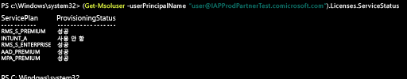

# 사용자 계정에 Intune 라이선스 할당

[!INCLUDE[classic-portal](../includes/classic-portal.md)]

수동으로 사용자를 추가하든 아니면 온-프레미스 Active Directory에서 동기화하든 상관없이 먼저 각 사용자에게 Intune 라이선스를 할당해야 사용자가 Intune에 장치를 등록할 수 있습니다.

## Office 365 관리 센터에서 Intune 라이선스 할당

[Office 365 포털](http://go.microsoft.com/fwlink/p/?LinkId=698854)을 사용하여 클라우드 기반 사용자를 수동으로 추가하고, 클라우드 기반 사용자 계정 및 온-프레미스 Active Directory에서 Azure AD로 동기화한 계정에 라이선스를 할당할 수 있습니다.

1.  테넌트 관리자 자격 증명을 사용하여 [Office 365 포털](http://go.microsoft.com/fwlink/p/?LinkId=698854)에 로그인한 후 **사용자** > **활성 사용자**를 선택합니다.

2.  Intune 사용자 라이선스를 할당할 사용자 계정을 선택한 후 **제품 라이선스** > **편집**을 선택합니다.

3.  **Intune** 또는 **Enterprise Mobility + Security**를 **켬**으로 전환하고 **저장**을 선택합니다.

4. 이제 사용자 계정은 서비스를 사용하고 장치를 관리에 등록하는 데 필요한 권한이 생겼습니다.

> [!NOTE]
> 사용자는 장치를 등록한 후에만 관리 콘솔에 표시됩니다. 또한 사용자 그룹을 선택하여 동시에 편집할 수 있습니다. 즉, 선택한 모든 사용자에 대한 라이선스를 추가하거나 바꾸도록 선택할 수 있습니다.

## PowerShell을 사용하여 EMS 사용자 라이선스를 선택적으로 관리
Microsoft Enterprise Mobility + Security(이전 명칭 Enterprise Mobility Suite)를 사용하는 조직에는 EMS 패키지의 Intune 서비스 또는 Azure Active Directory Premium만 필요한 사용자가 있을 수 있습니다. [Azure Active Directory PowerShell cmdlet](https://msdn.microsoft.com/library/jj151815.aspx)을 사용하여 한 가지 서비스 또는 서비스 하위 집합을 할당할 수 있습니다.

EMS 서비스에 대해 사용자 라이선스를 선택적으로 할당하려면, [Windows PowerShell용 Azure Active Directory 모듈](https://msdn.microsoft.com/library/jj151815.aspx#bkmk_installmodule)이 설치된 컴퓨터에서 관리자로 PowerShell을 엽니다. PowerShell은 로컬 컴퓨터 또는 ADFS 서버에 설치할 수 있습니다.

원하는 서비스 계획에만 적용되는 새로운 라이선스 SKU 정의를 만들어야 합니다. 이렇게 하려면, 적용하지 않을 계획은 비활성화합니다. 예를 들면, Intune 라이선스를 할당하지 않는 라이선스 SKU 정의를 만들 수 있습니다. 사용 가능한 서비스 목록을 보려면 다음을 입력합니다.

    (Get-MsolAccountSku | Where {$_.SkuPartNumber -eq "EMS"}).ServiceStatus

다음 명령을 실행하여 Intune 서비스 계획을 제외할 수 있습니다. 같은 방법을 사용하여 전체 보안 그룹으로 확장하거나 보다 세분화된 필터를 사용할 수 있습니다.

**예제 1** 
명령줄에서 새로운 사용자를 만들고 라이선스의 Intune 부분을 사용하지 않고 EMS 라이선스를 할당합니다.

    Connect-MsolService

    New-MsolUser -DisplayName “Test User” -FirstName FName -LastName LName -UserPrincipalName user@<TenantName>.onmicrosoft.com –Department DName -UsageLocation US

    $CustomEMS = New-MsolLicenseOptions -AccountSkuId "<TenantName>:EMS" -DisabledPlans INTUNE_A
    Set-MsolUserLicense -UserPrincipalName user@<TenantName>.onmicrosoft.com -AddLicenses <TenantName>:EMS -LicenseOptions $CustomEMS

다음을 통해 검증합니다.

    (Get-MsolUser -UserPrincipalName "user@<TenantName>.onmicrosoft.com").Licenses.ServiceStatus

**예제 2:** 
이미 라이선스가 할당된 사용자에 대한 EMS 라이선스의 Intune 부분을 비활성화합니다.

    Connect-MsolService

    $CustomEMS = New-MsolLicenseOptions -AccountSkuId "<TenantName>:EMS" -DisabledPlans INTUNE_A
    Set-MsolUserLicense -UserPrincipalName user@<TenantName>.onmicrosoft.com -LicenseOptions $CustomEMS

다음을 통해 검증합니다.

    (Get-MsolUser -UserPrincipalName "user@<TenantName>.onmicrosoft.com").Licenses.ServiceStatus

>[!div class="step-by-step"]

>[&larr; **사용자를 Intune에 동기화**](.\start-with-a-paid-subscription-to-microsoft-intune-step-2.md)     [**사용자 및 장치 구성** &rarr;](.\start-with-a-paid-subscription-to-microsoft-intune-step-5.md)  

