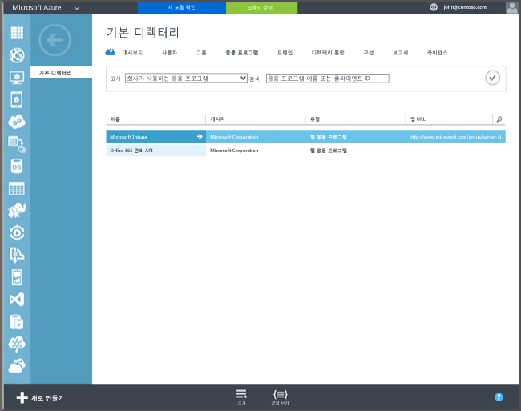

## Azure Active Directory 등록

사용자는 자동 등록을 통해 회사 또는 학교 계정을 추가하고 관리에 동의하여 Intune에서 회사 소유 또는 개인 Windows 10 PC 및 Windows 10 Mobile 장치를 등록할 수 있습니다. 그 외에 사용자가 별도로 수행해야 하는 작업은 전혀 없습니다. 사용자 장치는 백그라운드에서 등록되어 Azure Active Directory에 가입됩니다. 등록된 장치는 Intune을 통해 관리됩니다.

**필수 구성 요소**
- Azure Active Directory Premium 구독([평가판 구독](http://go.microsoft.com/fwlink/?LinkID=816845))
- Microsoft Intune 구독

### 자동 MDM 등록 구성

1. [Azure 관리 포털](https://manage.windowsazure.com)(https://manage.windowsazure.com)에서 **Active Directory** 노드로 이동한 다음 자신의 디렉터리를 선택합니다.

2. **응용 프로그램** 탭을 클릭하면 응용 프로그램 목록에 **Microsoft Intune**이 표시됩니다.

    

3. **Microsoft Intune**의 화살표를 클릭하면 Microsoft Intune을 구성할 수 있는 페이지가 표시됩니다.

4. **구성**을 클릭하여 Microsoft Intune을 통한 자동 MDM 등록 구성을 시작합니다.

5. Intune의 URL을 지정합니다.

  - **MDM 등록 URL** – MDM 등록 URL로는 `https://enterpriseenrollment-s.manage.microsoft.com/EnrollmentServer/Discovery.svc`를 사용합니다.
  - **MDM 사용 약관 URL** – 기본값을 사용합니다. 장치를 등록할 때 이 URL에 사용자용 사용 약관이 표시됩니다.
  - **MDM 준수 URL** – 기본값을 사용합니다. 장치가 미준수 상태로 확인되면 이 URL과 함께 **액세스 거부** 메시지가 표시됩니다. 이 URL을 클릭하면 장치가 정책을 준수하지 않는 이유 및 장치를 다시 준수 상태로 설정하는 방법을 파악할 수 있는 페이지로 이동할 수 있습니다.

6.  Microsoft Intune에서 관리해야 하는 사용자의 장치를 지정합니다. 이러한 사용자의 Windows 10 장치는 Microsoft Intune에서 관리되도록 자동으로 등록됩니다.

  - **모두**
  - **Groups**
  - **없음**

7. **저장**을 선택합니다.

<!--HONumber=Aug16_HO5-->

