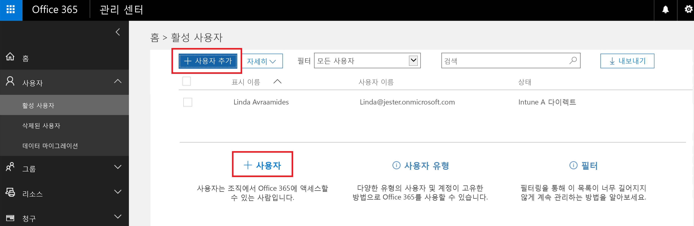
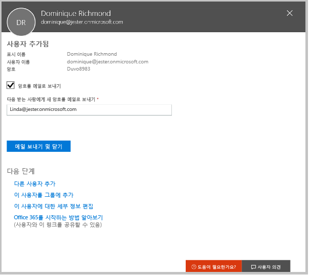
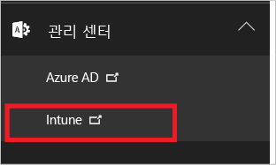
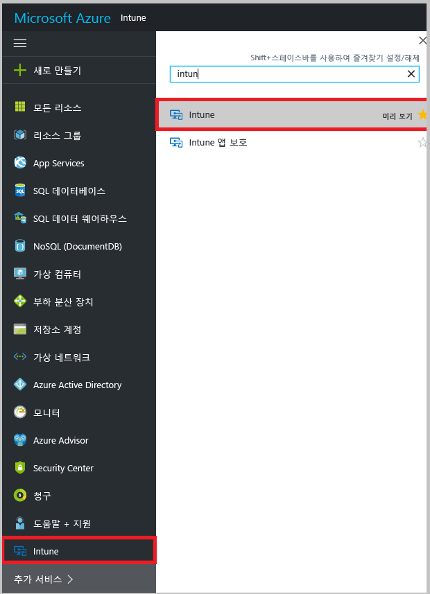

# Microsoft Intune 무료 평가판 등록

[!INCLUDE[classic-portal](../includes/classic-portal.md)]

이 문서에서는 Intune 평가판에 등록하는 과정을 안내하며, 관련 평가 가이드에 따라 Intune에서 모바일 장치를 관리하는 방법을 확인할 수 있도록 일부 사용자와 함께 평가판을 준비합니다. <!---or app data when devices are not enrolled in Intune.--->

>[!Note]
> 2016년 12월부터 Microsoft Intune이 Azure Portal로 이동하고, 몇 가지 무료 평가판 등록이 Azure Portal의 Intune에 포함되며 일부는 클래식 Intune에 포함됩니다. 평가판이 Azure Portal에 있는 경우 이 문서의 단계를 완료하면 [Intune Azure 미리 보기 콘텐츠](https://docs.microsoft.com/en-us/intune-azure/introduction/what-is-microsoft-intune)를 더 유용하게 활용할 수 있습니다.

## 가정
이 등록 문서 및 가이드에서는 평가 목적으로만 평가판을 사용하며, 구독할 때 새 환경에서 시작하는 것으로 가정합니다.

평가판을 쉽게 시작할 수 있도록 Intune만 사용하는 매우 간단한 환경을 설정하며, 이 환경이 모바일 장치를 관리하는 유일한 방법(모바일 장치 관리 기관이라고 함)인 것으로 가정합니다. 그러나 보다 자세한 내용을 살펴볼 수 있도록 가이드 전체에서 심층적인 기술 콘텐츠를 안내합니다.

평가판에서는 구독 버전에서 수행할 수 있는 모든 작업을 수행할 수 있습니다. 다만, 평가판에서는 사용자 계정이 100개로 제한됩니다.

## 평가판 등록
[Intune 등록](https://portal.office.com/Signup/Signup.aspx?OfferId=40BE278A-DFD1-470a-9EF7-9F2596EA7FF9&dl=INTUNE_A&ali=1#0%20) 페이지를 방문하여 평가판 구독에 등록하는 양식을 작성합니다.

회사 또는 학교 계정이 있고 Intune 평가판에 이 계정을 사용하려면 대신 [이 로그인 지침](https://docs.microsoft.com/en-us/intune/get-started/start-with-a-paid-subscription-to-microsoft-intune-step-1)을 따르세요. 그러나 이 문서 및 해당 평가 가이드에서는 이러한 계정을 사용하지 않는 것으로 가정합니다.

> [!TIP]
> 대부분의 IT 작업자 및 사용자가 여러분과 다른 로캘에 있는 경우 평가판에 대해 해당 로캘을 설정하여 성능을 테스트할 수 있습니다.

### 등록 후 고려 사항
평가판에 등록하는 경우 등록 과정 중에 제공한 전자 메일 주소로 계정 정보를 포함하는 전자 메일 메시지를 받게 됩니다. 이 전자 메일을 통해 평가판이 활성화된 것을 확인합니다.

등록 과정을 완료하면, Office 365 관리 센터를 사용하여 사용자를 추가하고 사용자에게 라이선스를 할당하는 데 사용되는 페이지로 이동됩니다. 다음에 **클래식 Intune** (https://manage.microsoft.com) 에 로그인하면 Intune 관리 콘솔로 자동으로 이동됩니다.

평가판이 **Azure Portal**에 있는 경우 https://portal.azure.com으로 이동하여 Intune 평가판 자격 증명을 사용해 로그인합니다.

## 사용자 추가
Intune용 Office 365 관리 센터를 나가기 전에 평가판 계정에 일부 사용자를 추가해야 합니다.

Office 365 관리 센터에서 .csv 파일을 업로드하여 사용자를 개별적 또는 일괄적으로 추가할 수 있습니다. 여기에서는 둘 다를 수행하여 평가판을 등록합니다. 그러나 프로덕션 환경에서는 Azure Active Directory 사용자 계정을 사용할 수 있을 것입니다. 이 계정에 대한 자세한 내용은 [시작 가이드](https://docs.microsoft.com/en-us/intune/get-started/start-with-a-paid-subscription-to-microsoft-intune-step-3) 및 이 문서의 [다음 단계](#Next-steps) 섹션에서 확인할 수 있습니다.

### 개별 사용자 추가
1. 사용자를 추가하는 두 가지 옵션 중 하나를 선택하여 사용자를 만들 수 있는 양식을 열 수 있습니다. 별표(\*)가 있는 항목만 필요합니다.

2.  사용자를 추가한 경우 마지막 단계로, 임시 Intune 암호가 포함된 메일을 사용자에게 보내야 합니다. 이 평가의 목적상 여기에서는 로그온 정보를 받고 사용자에게 제공되는 메일을 볼 수 있도록 회사 메일 주소를 사용합니다. 그런 다음 이러한 사용자 ID를 사용하여 테스트 장치를 등록할 수 있습니다. 

 

3. 사용자를 만든 후 관리자 역할을 할당하려는 경우 Office 365 관리 센터의 사용자 목록에서 사용자 이름을 선택한 다음 **편집**을 선택(역할을 선택하여 해당 사용자에게 할당할 수 있는 사용자 역할 목록이 표시됨)하여 역할을 편집할 수 있습니다.

 

### 여러 사용자 가져오기
1. **자세한** 목록에서 여러 사용자를 가져오는 마법사를 찾을 수 있습니다.

 

2. .csv 파일을 올바르게 설정하기 위해 템플릿 파일을 다운로드하여 사용자 데이터로 채울 수 있습니다. 각 필드에 필요한 데이터 종류를 정확히 확인하기 위해 헤더 및 샘플 사용자 정보가 포함된 .csv 파일을 다운로드합니다.

 

3. .csv 파일을 만들고 저장한 후에는 **찾아보기**를 선택하여 파일을 선택합니다. 확인한 후 **다음**을 선택합니다. 사용자가 업로드되고 활성 사용자 목록에 추가됩니다.

> [!NOTE]
> 관리할 장치에 사용자를 등록할 때까지 Intune에 사용자가 표시되지 않습니다.

이제 Intune에서 사용자 관리와 사용자의 장치 및 앱 관리를 시작할 수 있습니다.

## 관리자 환경 계속 유지
### 클래식 Intune
클래식 Intune에 사용할 수 있는 포털은 다음과 같이 두 가지입니다.
- Office 365 관리 센터([portal.office.com](https://portal.office.com))
- Intune 관리 콘솔([manage.microsoft.com](https://manage.microsoft.com))

일반적으로는 아래에 나와 있는 Intune 관리 콘솔에서 작업을 수행합니다. 이 사이트에서는 그룹, 정책, 장치 및 앱을 설정하고 관리할 수 있습니다.

반면, 아래에 나와 있는 Office 365 관리 센터는 사용자 및 계정의 다른 측면(예: 대금 청구 및 지원)을 추가하고 관리하는 데 사용됩니다.

Office 365 관리 센터에서 Intune 관리 콘솔로 이동할 수 있습니다. 관리 센터는 왼쪽 탐색 창의 마지막 항목 아래에 있습니다. **Intune**을 선택하여 새 탭에서 Intune 관리 콘솔을 엽니다.

Intune에서 Office 365 관리 센터로 다시 돌아가려면 그룹 개요 페이지에서 **사용자 추가** 작업을 추가합니다.

### Intune Azure 미리 보기
Intune Azure 미리 보기에 사용할 수 있는 포털은 다음과 같은 세 가지입니다.
- Office 365 관리 센터([portal.office.com](https://portal.office.com))
- Azure의 Intune 대시보드([portal.azure.com](https://portal.azure.com))
- 클래식 Intune 관리 콘솔([manage.microsoft.com](https://manage.microsoft.com))

Azure에서 Intune에 처음으로 로그온할 때 Azure 대시보드에 Intune이 표시되지 않을 수 있습니다. Azure 대시보드에 Intune 서비스를 추가하려면 다음을 수행합니다.
1. 대시보드의 왼쪽에 있는 Azure 서비스 목록에서 **기타 서비스 >**를 선택하고 검색 상자에 Intune을 입력합니다.
2. 목록에서 **Intune**을 선택하고, 별표를 선택하여 서비스 목록에 서비스를 추가합니다.  
3. Intune 대시보드를 열려면 서비스 목록에서 **Intune**을 선택합니다.

일반적으로 아래에 표시된 Intune 대시보드에서 작업을 수행합니다. 이 사이트에서는 그룹, 정책, 장치 및 앱을 설정하고 관리할 수 있습니다. **클래식 Intune 포털 열기** 타일을 선택하면 대시보드에서 클래식 Intune 관리 콘솔로 이동할 수 있습니다. Intune Azure 미리 보기로 돌아가려면 브라우저 주소 표시줄에 https://portal.azure.com을 입력한 후 서비스 목록에서 **Intune**을 다시 선택합니다.

 

반면, 아래에 나와 있는 Office 365 관리 센터는 사용자 및 계정의 다른 측면(예: 대금 청구 및 지원)을 추가하고 관리하는 데 사용됩니다.

Office 365 관리 센터에서 Intune 대시보드로 이동하려면 브라우저 주소 표시줄에 https://portal.azure.com을 입력합니다. 서비스 목록에서 **Intune**을 선택합니다.

Intune에서 Office 365 관리 센터로 돌아가려면 브라우저 주소 표시줄에 https://portal.office.com을 입력합니다. Intune에 이미 로그인한 경우 Office 365 관리 센터로 바로 이동됩니다.

## 다음 단계
### 클래식 Intune
평가 시나리오: [Microsoft의 모바일 장치 관리 평가](mobile-device-management-trial-guide-microsoft-intune.md)

### Intune Azure 미리 보기
[Azure Portal 미리 보기의 Intune](https://docs.microsoft.com/en-us/intune-azure/introduction/what-is-microsoft-intune)에 대해 자세히 알아보세요.

### 다른 제품과의 통합
Intune에서 Azure Active Directory 사용자 계정을 사용하는 방법을 자세히 알아봅니다.
- [ID 요구 사항](https://docs.microsoft.com/en-us/active-directory/active-directory-hybrid-identity-design-considerations-overview#design-considerations-overview)
- [디렉터리 동기화 요구 사항](https://docs.microsoft.com/en-us/active-directory/active-directory-hybrid-identity-design-considerations-directory-sync-requirements)
- [다단계 인증 요구 사항](https://docs.microsoft.com/en-us/active-directory/active-directory-hybrid-identity-design-considerations-multifactor-auth-requirements)

[System Center Configuration Manager와 함께 Intune](https://docs.microsoft.com/en-us/sccm/mdm/understand/hybrid-mobile-device-management)를 사용하는 방법에 대해 자세히 알아보기

