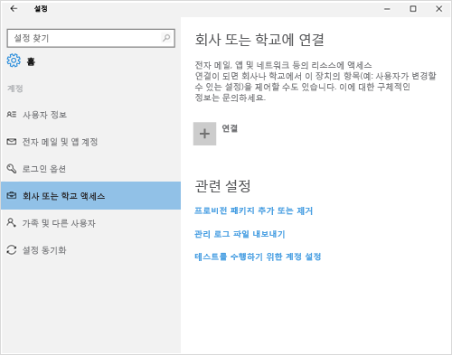
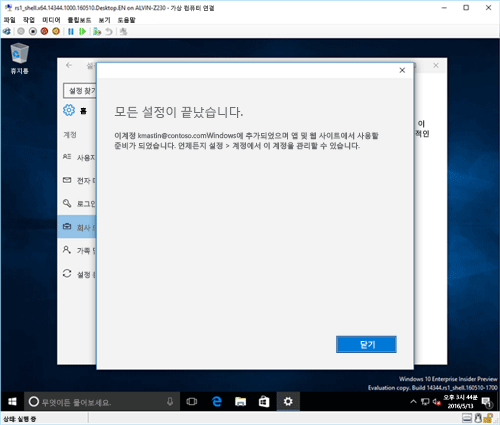

# Intune에서 Windows 10 장치 등록

> [!NOTE]
> Windows 10은 모든 유형의 장치에서 작동합니다. 데스크톱, 휴대폰 또는 태블릿에 따라 이 페이지의 그림과 다소 다르더라도 모두 동일한 단계를 따르면 됩니다.

> [!VIDEO https://channel9.msdn.com/Series/IntuneEnrollment/Windows-Enrollment/player]

1. **시작**으로 이동합니다.

  - **Windows 10 데스크톱** 장치를 사용하는 경우 **시작 메뉴**로 이동합니다.
  - **Windows 10 Mobile** 장치를 사용하는 경우 **시작 화면**으로 가서 살짝 밀면 **모든 앱** 목록이 표시됩니다.

2.  검색 창에서 "설정"을 검색하여 Windows **설정** 앱을 엽니다.

3. **계정** > **회사 또는 학교 액세스** > **연결**을 선택합니다.

    

3.  회사 또는 학교 메일 주소를 입력하고 **다음**을 선택합니다.

    

4. 회사 또는 학교 계정을 사용하여 Intune에 로그인합니다.

    

    회사 또는 학교에서 내 장치를 등록하고 있다는 메시지가 표시됩니다.

5. **모두 설정되었습니다.** 화면이 표시되면 **닫기**를 선택합니다. 작업을 완료했습니다.

  

6. 연결이 올바르게 되었는지 다시 확인하고 싶은 경우 **설정**으로 돌아가면 이제 회사 또는 학교 계정이 나열되어 있는 것을 볼 수 있습니다.

    

위의 단계를 수행해도 여전히 회사 또는 학교 전자 메일 계정 및 파일에 액세스할 수 없는 경우 [회사 또는 학교 액세스가 표시되는 경우 따라야 하는 문제 해결 절차](troubleshoot-your-windows-10-device-windows.md#troubleshooting-steps-to-follow-if-you-see-access-work-or-school)의 단계를 수행합니다.
