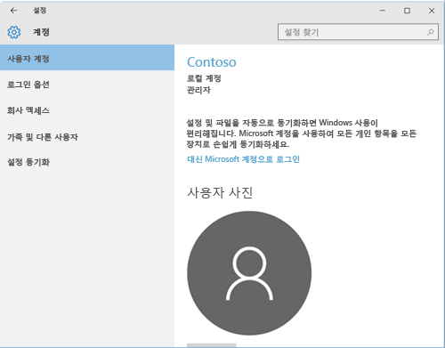
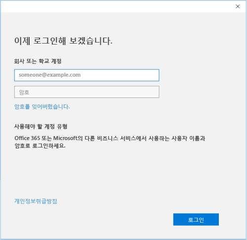

# Intune에서 Windows 10 장치 등록

  > [!NOTE]
  > Windows 10은 모든 유형의 장치에서 작동합니다. 데스크톱, 휴대폰 또는 태블릿에 따라 이 페이지의 그림과 다소 다르더라도 모두 동일한 단계를 따르면 됩니다.

1.  **시작**으로 이동합니다.

  - **Windows 10 데스크톱** 장치를 사용하는 경우 **시작 메뉴**로 이동합니다.
  - **Windows 10 Mobile** 장치를 사용하는 경우 **시작 화면**으로 가서 살짝 밀면 **모든 앱** 목록이 표시됩니다.

2. 검색 창에서 "설정"을 검색하여 Windows **설정** 앱을 엽니다.

3. **계정**을 선택합니다.

    

4. **계정**을 선택합니다.

    

5. **회사 또는 학교 계정 추가**를 선택합니다.

    

6. 회사 또는 학교 자격 증명으로 로그인합니다.

    

회사 또는 학교 메일, 파일 또는 기타 데이터에 여전히 액세스할 수 없나요? [사용자 계정으로 문제 해결](troubleshoot-your-windows-10-device-windows.md#troubleshooting-steps-to-follow-if-you-see-your-account)을 시도하여 액세스 문제를 해결해 보세요. 여전히 작동하지 않으면 회사 지원팀에 연락하여 도움을 요청하세요.

회사 포털 앱에서 사용할 수 있는 연락처 정보를 찾고 일상 업무에 적합한 권장 앱과 필수 앱을 다운로드하여 간단하게 회사 지원팀의 도움을 받을 수 있습니다. 회사 포털 앱이 장치에 설치되어 있을 수도 있습니다. __모든 앱__ 목록에서 __회사 포털__을 찾아 빨리 확인할 수 있습니다.

앱 목록에 회사 포털이 표시되지 않으면 다음 단계를 따라 설치합니다.

1. **시작** > **저장소**를 선택합니다.

2. **검색**을 선택하고 **회사 포털**을 입력합니다.

3. 결과 목록에서 **회사 포털** > **설치**를 선택합니다.

4. **설치** 또는 **무료** 중 하나를 선택합니다. 이 두 옵션 간에는 아무 차이가 없습니다. 표시되는 옵션은 조직이 회사 포털 앱을 어떻게 설정했는지에 따라 달라집니다.
