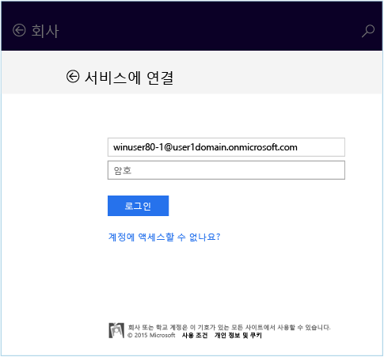

# Intune에서 Windows 8.1 또는 Windows RT 8.1 장치를 등록하는 방법

회사 또는 학교에서 Microsoft Intune을 사용하는 경우 장치를 등록하여 회사 전자 메일, 파일 및 기타 리소스에 액세스 권한을 얻을 수 있습니다. 장치를 등록하면 조직에서 회사 데이터 보안을 유지할 수 있습니다. 등록에 대해 자세히 알아보려면 [Intune에서 회사 포털 앱을 설치하고 장치를 등록하면 어떻게 되나요?](what-happens-if-you-install-the-company-portal-app-and-enroll-your-device-in-intune-windows.md) 및 [IT 관리자가 장치에서 할 수 있는 일과 할 수 없는 일](what-info-can-your-company-see-when-you-enroll-your-device-in-intune.md)을 참조하세요.

Windows 8.1 또는 Windows RT 8.1 장치를 등록하려면:

1.  장치에서 **설정** &gt; **PC 설정** &gt; **네트워크** &gt; **회사**를 탭합니다.

    

2.  필요할 경우 사용자 ID에 대한 회사 또는 학교 메일을 입력하고 **가입**을 탭합니다.

    사용자 ID가 필요하지 않은 경우에는 이 장치에 로그인할 때 입력한 메일 주소가 사용됩니다.

3.  회사 또는 학교 메일의 암호를 입력합니다.

    

4.  **장치 관리 설정**에서 **켜기**를 탭합니다.

    

5.  **IT 관리자의 앱 및 서비스 허용** 대화 상자에서 **동의함** 확인란을 선택한 다음 **켜기**를 탭합니다.

    

    성공적으로 등록하면 다음 화면이 표시됩니다.

    

또한 사용자 및 사용자의 역할과 관련된 회사 앱을 쉽게 식별하고 가져올 수 있으므로 회사 포털 앱을 설치하는 것이 좋습니다. 회사에서 Intune을 설정한 방식에 따라 회사 포털 앱이 등록 프로세스의 일부로 설치되었을 수 있습니다. 앱이 있는지 확인하려면 앱 목록에서 **회사 포털**을 찾습니다. 앱 목록에 회사 포털이 표시되지 않으면 다음 단계를 따라 설치합니다.

1.  **시작** &gt; **스토어**를 탭합니다.

2.  **검색**을 탭하고 **회사 포털**을 입력합니다.

3.  결과 목록에서 **회사 포털**을 탭합니다.

4.  **설치** 또는 **무료** 중 하나를 탭합니다. 표시되는 옵션은 회사에서 앱을 설정한 방법에 따라 달라집니다.

여전히 도움이 필요하세요? IT 관리자에게 문의하세요. IT 관리자의 연락처 정보는 [회사 포털 웹 사이트](http://portal.manage.microsoft.com)를 참조하세요.
