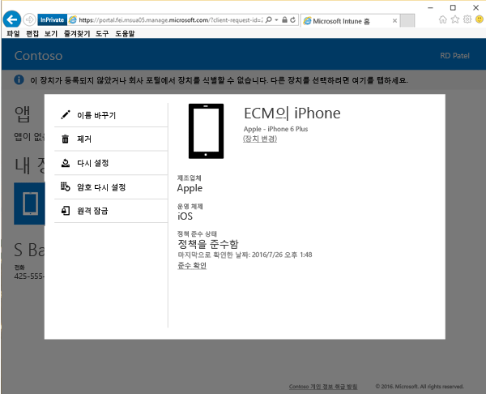

# 회사 포털에서 장치 제거

회사나 조직에서 장치를 더 이상 관리하지 않도록 하려면 [회사 포털 웹 사이트](http://portal.manage.microsoft.com)를 사용하여 회사 포털에서 장치를 제거할 수 있습니다. 회사 포털 웹 사이트는 IT부서에서 관리에 등록한 컴퓨터와 장치를 관리하는 데 사용할 수 있는 웹 페이지입니다. 장치를 제거하면 회사 포털에 장치가 더 이상 나열되지 않으며 회사 또는 학교 데이터, 앱 및 전자 메일에 액세스할 수도 없습니다.

장치를 제거하려면:

1.    [회사 포털 웹 사이트](http://portal.manage.microsoft.com)에서 __메뉴__ 단추 를 탭한 다음 __내 장치__를 선택합니다.

  

2. __내 장치__ 페이지에서 이동할 장치의 이름을 선택합니다.

    

3.    장치가 팝업 창에서 열립니다. **제거** 단추를 탭합니다.

      

4. 경고 메시지를 읽고 **제거**를 탭하여 회사 포털에서 장치를 제거합니다.

여전히 도움이 필요하세요? IT 관리자에게 문의하세요. 연락처 정보는 [회사 포털 웹 사이트](http://portal.manage.microsoft.com)를 참조하세요.

