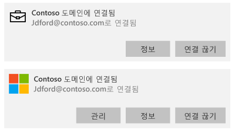
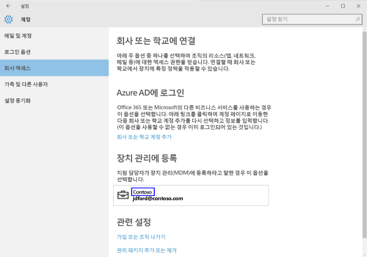
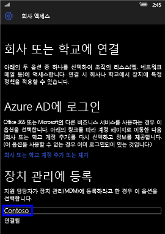
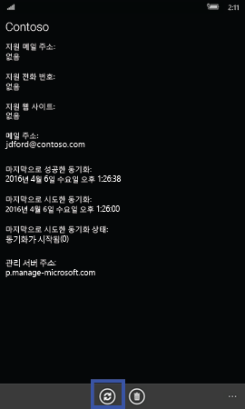
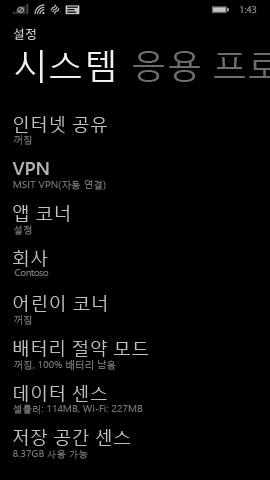

# 수동으로 Windows 장치 동기화

앱 설치 속도가 최적 속도보다 느린 경우 수동 장치 동기화를 시작합니다. 수동 동기화는 최신 업데이트 및 통신을 위해 장치를 Intune과 강제로 연결합니다. 장치 동기화가 완료된 후에 설치 속도가 증가할 수 있습니다.

Intune은 회사 포털 앱 및 장치 설정 앱에서 수동 동기화를 지원합니다. 

회사 포털 앱 기능은 크리에이터스 업데이트(1703) 이상을 실행하는 Windows 10 장치에서 지원됩니다. 
* [회사 포털 앱에서 동기화](#Sync-from-Company-Portal-app-for-Windows)  

모든 Windows 장치는 다음을 포함한 장치 설정 앱에서 동기화할 수 있습니다.

* [Windows 10 Desktop](#windows-10-desktop)  
* [Microsoft HoloLens](#microsoft-hololens)   
* [Windows 10 Mobile](#windows-10-mobile)  
* [Windows Phone 8.1](#windows-phone-81)    

## Windows용 회사 포털 앱에서 동기화
크리에이터스 업데이트(버전 1703) 이상을 실행하는 Windows 10 장치를 수동으로 동기화하려면 다음 단계를 완료합니다.

1.  장치에서 회사 포털 앱을 엽니다.

2.  **설정** > **동기화**를 선택합니다.

      
    
        

## 설정 앱에서 동기화 
설정 앱에서 Microsoft HoloLens, Windows 10 desktop, Windows 10 Mobile 또는 Windows Phone 8.1 장치를 수동으로 동기화하려면 다음 단계를 완료합니다.

### Windows 10 Desktop
1. 장치에서 **시작** > **설정**을 선택합니다.

2. **계정**을 선택합니다.

      

3. 데스크톱용 Windows 10은 버전이 여러 개 있습니다. 아래 스크린샷과 화면을 비교하여 수행할 일련의 단계를 확인합니다. 

    * 화면에 **회사 또는 학교 액세스**가 표시되면 [회사 또는 학교 액세스](#access-work-or-school)의 단계로 건너뜁니다.

      

    * 화면에 **회사 액세스**가 표시되면 [회사 액세스](#work-access) 아래의 단계로 건너뜁니다.  

    

#### 회사 또는 학교 액세스

1. **회사 또는 학교 액세스**를 클릭합니다.

      

2. 옆에 서류 가방 아이콘이 있는 계정을 선택합니다. 이 계정이 표시되지 않으면 회사에서 설정을 다른 방식으로 구성했을 수 있습니다. 대신에 옆에 Microsoft 로고가 있는 계정을 클릭합니다.

     

3. **정보**를 클릭합니다. 

4. **동기화**를 클릭합니다. 

#### 회사 액세스 단계

1.  **회사 액세스**를 클릭합니다.

    

2. **장치 관리에 등록**에서 회사 이름을 선택합니다.

    

3. **동기화**를 클릭합니다. 동기화가 완료될 때까지 단추를 사용할 수 없습니다.

      

### Windows 10 Mobile

   1. 장치에서 **모든 앱** > **설정** > **계정**으로 이동합니다.

       

   2. **회사 액세스**를 선택합니다.

       

   3. **장치 관리에 등록**에서 회사 이름을 선택합니다.

       

   4. **동기화** 아이콘을 선택합니다. 동기화가 완료될 때까지 단추를 사용할 수 없습니다.

         
### Microsoft HoloLens  
이러한 지침은 Windows 10 1주년 업데이트(RS1이라고도 함)를 실행하는 HoloLens 장치에 적용됩니다. 
1.  장치에서 설정 앱을 엽니다.  

2.  **계정** > **회사 액세스**를 선택합니다.  
      

3.  연결된 계정 > **동기화**를 선택합니다.   

### Windows Phone 8.1

1. **모든 앱** > **설정** > **회사**로 이동합니다.

    

2. 회사 이름을 선택합니다.

    

3. **동기화** 아이콘을 선택합니다.

    

여전히 도움이 필요하세요? 회사 지원 부서에 문의하세요. 연락처 정보는 [회사 포털 웹 사이트](https://portal.manage.microsoft.com#HelpDeskDialog)를 참조하세요.
